# 日本株財務分析ツール — 完全アーキテクチャ図

> **閲覧方法**: VS Code に「Markdown Preview Mermaid Support」拡張をインストールし、`Ctrl+Shift+V` でプレビューを開くと図が表示されます。

---

## 目次

1. [全体構成図（コンポーネント図）](#1-全体構成図コンポーネント図)
2. [ユースケース図](#2-ユースケース図)
3. [データベース設計（ER図）](#3-データベース設計er図)
4. シーケンス図
   - [4-1. 財務データ収集フロー](#4-1-財務データ収集フロー)
   - [4-2. 株価履歴収集フロー](#4-2-株価履歴収集フロー)
   - [4-3. 認証フロー](#4-3-認証フロー)
   - [4-4. 業種別OLS分析フロー](#4-4-業種別ols分析フロー)
   - [4-5. スクリーニングフロー](#4-5-スクリーニングフロー)
   - [4-6. Zスコア正規化フロー](#4-6-zスコア正規化フロー)
   - [4-7. エラー・キャンセルフロー](#4-7-エラーキャンセルフロー)
5. [画面遷移図](#5-画面遷移図)
6. [データ変換フロー](#6-データ変換フロー財務データが分析結果になるまで)
7. [プラグインシステム（クラス図）](#7-プラグインシステムクラス図)
8. [REST API エンドポイント一覧](#8-rest-api-エンドポイント一覧)
9. [デプロイ構成図](#9-デプロイ構成図)
10. [ファイル役割一覧](#10-ファイル役割一覧)

---

## 1. 全体構成図（コンポーネント図）

> ブラウザ・サーバー・DB・外部APIの全体像と接続関係を示します。
> ローカルと Render は同一 Supabase DB を共有し、役割で使い分けます。

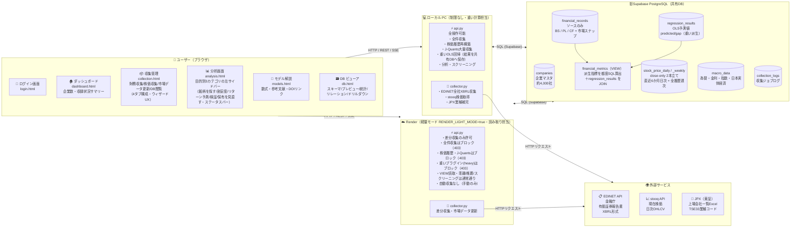

---

## 2. ユースケース図

> ユーザーがこのツールで「できること」の全体像です。

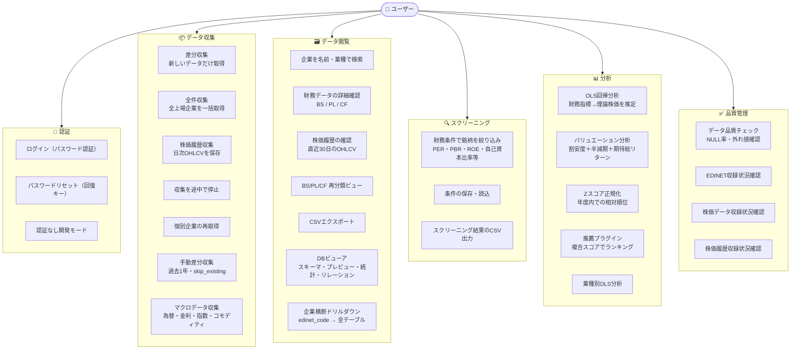

---

## 3. データベース設計（ER図）

> テーブルの構造と主要カラム、テーブル間の関係を示します。
> `||--o{` は「1対多」（1社に対して複数の財務レコードが存在する）を意味します。
> `macro_data` は企業に紐づかない独立テーブル（マクロ環境データ）です。
>
> **計算結果と生データのDB分離（重要）**:
> - `financial_records` は **ソース（XBRL再分類＋市場スナップショット）のみ**を保持する。
> - 軽い派生指標（営業利益率・ROE・自己資本比率・D/E・CF比率・研究開発/減価償却集約度・ネットキャッシュ・各Zスコア・成長率）は
>   **`financial_metrics` VIEW がソース列から都度SQL算出**する（DBに永続化しない＝関数型）。
> - 重い派生（OLS予測値 `predicted_market_cap` / `gap_ratio`）は **`regression_results` テーブル**に隔離保存する。
> - アプリの読み取りは ORM `FinancialMetric`（VIEW）経由で、ソース＋派生＋予測値をまとめて取得する。
>   VIEW の計算は Supabase 側で走るため Render の CPU を消費しない。

```mermaid
erDiagram
    companies {
        int       id            PK  "自動採番ID"
        string    edinet_code   UK  "EDINETコード（E00001など）"
        string    sec_code          "証券コード（4桁 例:7203）"
        string    name              "会社名"
        string    industry          "業種（TSE33業種）"
        string    market            "市場区分（プライム/スタンダード/グロース）"
        int       fiscal_month      "決算月（3=3月決算など）"
        string    accounting_standard "会計基準（JGAAP/IFRS/US-GAAP）"
        datetime  created_at        "登録日時"
        datetime  updated_at        "更新日時"
    }

    financial_records {
        int     id                  PK "自動採番ID"
        string  edinet_code         FK "企業への紐付け"
        string  sec_code               "証券コード"
        int     year                   "決算年度（例:2024）"
        string  period_end             "決算期末日（YYYY-MM-DD）"
        string  doc_id                 "EDINET書類管理番号"
        string  accounting_standard    "会計基準"
        float   pl_revenue             "売上高（円）"
        float   pl_cost_of_sales      "売上原価（円）"
        float   pl_gross_profit       "売上総利益（円）"
        float   pl_sga                "販売費及び一般管理費（円）"
        float   pl_operating_profit   "営業利益（円）"
        float   pl_nonoperating_income "営業外損益純額=経常-営業（円）"
        float   pl_net_income          "純利益（円）"
        float   pl_eps                 "EPS 1株利益（円）"
        float   pl_ebitda              "EBITDA=営業利益+減価償却費（計算値・円）"
        float   pl_rd_expenses         "研究開発費（円・C2）"
        float   pl_depreciation        "減価償却費及び償却費（円・C2・EBITDA入力）"
        float   pl_extraordinary_income "特別利益（円・C2・JGAAP概念）"
        float   pl_extraordinary_loss  "特別損失（円・C2・JGAAP概念）"
        float   bs_total_assets        "総資産（円）"
        float   bs_receivables         "売掛金（円）"
        float   bs_inventory           "棚卸資産（円）"
        float   bs_buildings           "建物及び構築物（純額・円）"
        float   bs_machinery           "機械装置（純額・円）"
        float   bs_ppe_total           "有形固定資産合計（純額・円・C2・内訳整合用）"
        float   bs_intangible_assets   "無形固定資産（円）"
        float   bs_investments_other_assets "投資その他の資産合計（円・C2）"
        float   bs_payables            "買掛金（円）"
        float   bs_bonds_payable       "社債（円）"
        float   bs_paid_in_capital     "資本金（円）"
        float   bs_retained_earnings   "利益剰余金（円）"
        float   bs_total_equity        "純資産（円）"
        float   bs_bps                 "BPS 1株純資産（円）"
        float   bs_investment_securities "投資有価証券（円・清原式NC用）"
        float   cf_operating_cf        "営業キャッシュフロー（円）"
        float   cf_free_cf             "フリーCF=営業CF+投資CF（円）"
        float   stock_price            "株価（収集時点スナップショット）"
        float   market_cap             "時価総額（百万円・収集時点）※単位注意"
        float   per                    "PER（収集時点スナップショット）"
        float   pbr                    "PBR（収集時点スナップショット）"
        float   employees              "従業員数（連結・非財務・C2）"
        float   issued_shares          "期末発行済株式総数（表示・参考・C2）"
        datetime created_at            "登録日時"
        datetime updated_at            "更新日時"
    }

    regression_results {
        string  edinet_code         PK "企業（複合PK）"
        int     year                PK "決算年度（複合PK）"
        string  period_end          PK "決算期末日（複合PK・空文字許容）"
        float   predicted_market_cap   "OLS予測時価総額（百万円）"
        float   gap_ratio              "乖離率（%）=(予測-実際)/実際"
        string  model                  "ols / ridge"
        string  sector                 "学習に使った業種"
        datetime computed_at           "計算日時"
    }

    macro_gbdt_scores {
        string  edinet_code   PK "企業（最新スナップショットのみ・全置換）"
        float   mu               "M-2 予測 52週先対数リターン μ̂（producer・ADR-0004）"
        string  snapshot_date    "スナップ基準日 YYYY-MM-DD"
        datetime created_at      "計算日時"
    }

    stock_price_daily {
        string  edinet_code  PK "企業への紐付け（PK1）"
        string  trade_date   PK "取引日 YYYY-MM-DD（PK2）"
        float   close           "終値（NOT NULL）"
        float   volume          "出来高（VWAP算出用・週次集約時に消費）"
    }

    stock_price_weekly {
        string  edinet_code  PK "企業への紐付け（PK1）"
        string  week_start   PK "ISO週の月曜 YYYY-MM-DD（PK2）"
        string  trade_date      "週内最終営業日の実日付"
        float   close_last      "最終営業日終値（実約定・チャート/バックテスト）"
        float   volume_sum      "週内出来高合計（VWAP分母・欠落週はNULL）"
        float   turnover_sum    "週内売買代金合計 Σ(close×vol)（VWAP分子・流動性変量）"
        int     n_days          "週内に集約した営業日数（祝日週の信頼度）"
    }

    collection_logs {
        int      id                 PK "自動採番ID"
        string   job_type              "収集種別（full/incremental/single）"
        string   status                "状態（running/done/error/resolved）"
        datetime started_at           "開始日時"
        datetime finished_at          "終了日時"
        int      companies_processed  "処理企業数"
        int      records_saved        "保存レコード数"
        int      errors_count         "エラー件数"
        text     message              "補足メッセージ"
    }

    app_settings {
        string   key        PK "設定キー（例: APP_PASSWORD）"
        text     value         "設定値"
        datetime updated_at   "最終更新日時"
    }

    macro_data {
        int      id           PK "自動採番ID"
        string   series_code     "系列コード（USDJPY/US10Y/NIKKEI225/JP_REAL_GDP 等）"
        string   series_name     "表示名"
        string   category        "fx / rate / equity / commodity / credit / inflation / real_economy / labor / production / trade"
        string   trade_date      "取引日（YYYY-MM-DD）。FRED 低頻度系列は公表ラグ分シフト済（#250）"
        float    open            "始値"
        float    high            "高値"
        float    low             "安値"
        float    close           "終値（NOT NULL）"
        float    volume          "出来高（FX/金利系は NULL）"
        datetime created_at      "登録日時"
    }

    xbrl_raw_documents {
        int      id              PK "自動採番ID"
        string   doc_id          UK "EDINET書類管理番号（UNIQUE）"
        string   edinet_code        "EDINETコード（インデックス）"
        string   period_end         "決算期末日（YYYY-MM-DD）"
        bytes    elements_gz        "XBRL全行をgzip圧縮したJSON（BYTEA）"
        string   elements_format    "圧縮方式（gzip+json）"
        int      n_rows             "圧縮前の行数（健全性チェック用）"
        datetime fetched_at         "raw保存日時"
    }

    companies         ||--o{  financial_records    : "1社 → 複数年度の財務データ"
    companies         ||--o{  stock_price_daily    : "1社 → 直近6か月の日次終値"
    companies         ||--o{  stock_price_weekly   : "1社 → 全履歴の週次終値"
    xbrl_raw_documents }o--|| financial_records   : "doc_id で紐付け（再解析用）"
    financial_records ||--o| regression_results  : "(edinet_code,year,period_end) で1対0..1"
```

> **`financial_metrics`（VIEW・物理テーブルではない）**: `financial_records` をソースに、
> `op_margin` / `net_margin` / `roe` / `roa` / `equity_ratio` / `de_ratio` / `cf_ratio` /
> `asset_turnover`（総資産回転率＝売上/総資産・デュポン分解因子・M-1 特徴量） /
> `rd_intensity` / `da_intensity`（研究開発・減価償却の対売上集約度 [%]・C2列の結線） /
> `net_cash` / `nc_ratio` / `z_*`（8指標）/ `rev_growth` / `op_growth` / `eps_growth` を
> SQL で都度算出し、`regression_results` を LEFT JOIN して `predicted_market_cap` / `gap_ratio` も合成する。
> 算出式は旧 `collector.calc_derived` / `_calc_zscore_for_year` / `calc_growth_rates` と一致（移植）。

---

## 4-1. 財務データ収集フロー

> 「収集開始」ボタンから完了までの処理の流れです。

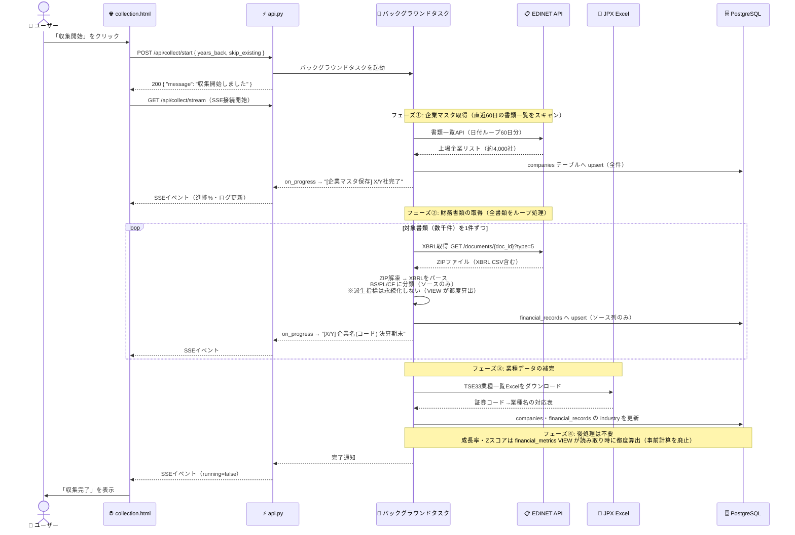

---

## 4-2. 株価履歴収集フロー

> 株価を取得し、**close-only の2本立て**（`stock_price_daily`＝直近6か月の日次／`stock_price_weekly`＝全履歴の週次集約）へ保存するフローです。容量恒久対策（Supabase Free 500MB）として旧 `stock_price_history`（日次OHLCV全履歴）から移行。詳細は [DEPLOYMENT.md「容量設計」](DEPLOYMENT.md) 参照。

**現在の主経路**: J-Quants（JPX公式）。GitHub Actions Runner（Azure IP）からは stooq が完全ブロック。

**フロー概要**（4-1 の財務収集と同じ起動パターン）:
1. `POST /api/collect/history/start { years_back, max_companies }` → バックグラウンドタスク起動 → 200 即返し
2. UI が `GET /api/collect/history/stream` で SSE 接続
3. BGT が `SELECT edinet_code, sec_code FROM companies WHERE sec_code IS NOT NULL` で企業一覧取得
4. 全企業ループ（J-Quants: 日付単位で全銘柄一括取得・`JQUANTS_RATE_SLEEP=20秒`; stooq ローカル補助: 1社1リクエスト・1.5秒）
5. 単一チョークポイント `record_prices_batch`（database.py）で **①daily upsert → ②触れた週のみ daily から weekly を再集約 upsert（aggregate_weeks）→ ③daily を直近 `DAILY_WINDOW_DAYS` で trim**。3経路（J-Quants/stooq/yahoo）すべてが通る。専用スケジューラ不要（収集に相乗り）
6. `on_progress` → SSE で進捗配信 → 完了後 `running=false`
7. UI が `GET /api/collect/history/coverage` で収録状況を更新表示

制約値・優先度ルールは [DEPLOYMENT.md「外部サービス制約」](DEPLOYMENT.md) 参照。

---

## 4-3. 認証フロー

> `APP_PASSWORD` が設定されている場合のみ認証が有効になります。未設定時は開発モードとして全APIが素通りします。

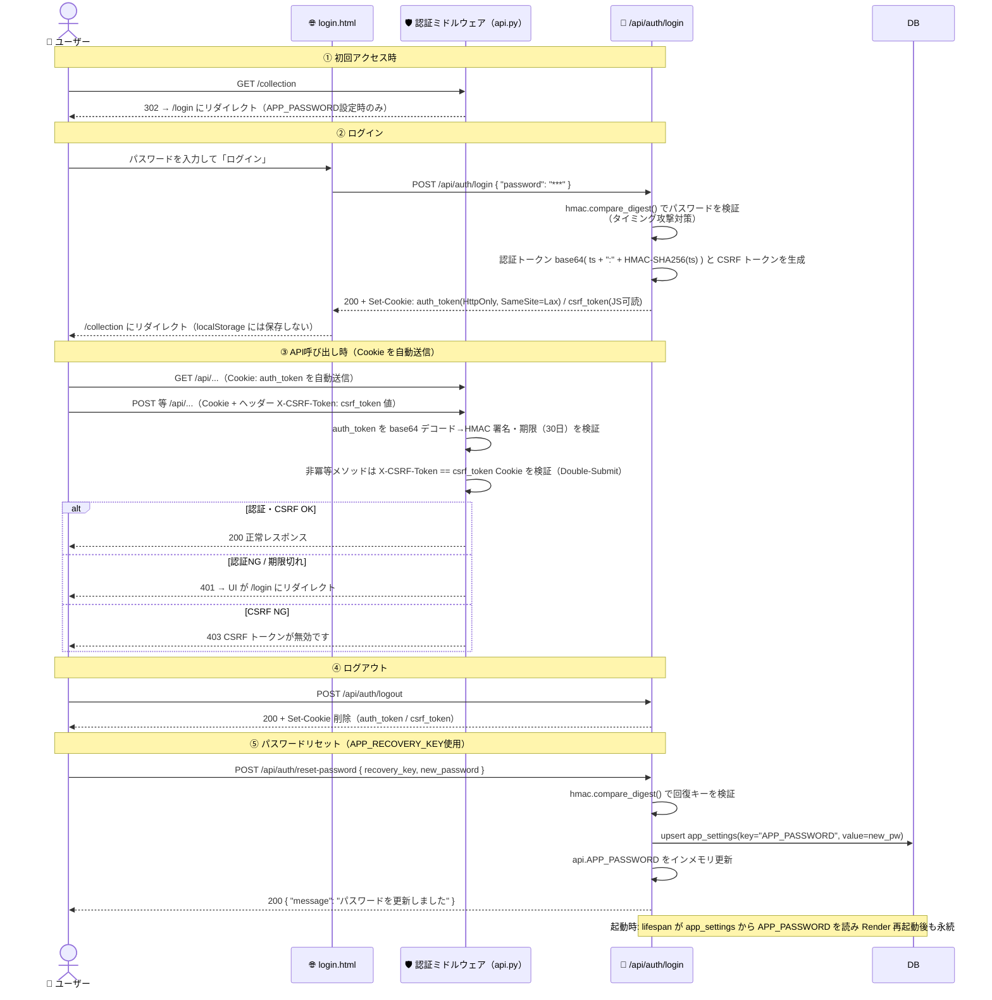

### セキュリティレスポンスヘッダ（`_SecurityHeadersMiddleware`）

全レスポンスに以下を付与する（`api.py`）。

| ヘッダ | 値 | 目的 |
|---|---|---|
| `Content-Security-Policy` | `default-src 'self'; script-src 'self' https://cdn.jsdelivr.net; style-src 'self' 'unsafe-inline'; connect-src 'self'; img-src 'self' data:; object-src 'none'; base-uri 'self'; form-action 'self'; frame-src 'none'; frame-ancestors 'none'` | XSS・クリックジャッキング・フォーム乗っ取り等の緩和 |
| `X-Content-Type-Options` | `nosniff` | MIME スニッフィング防止 |
| `X-Frame-Options` | `DENY` | クリックジャッキング防止（`frame-ancestors 'none'` と併用） |
| `Referrer-Policy` | `strict-origin-when-cross-origin` | リファラ漏洩抑制 |
| `Permissions-Policy` | `geolocation=(), camera=(), microphone=(), payment=(), usb=()` | 不使用ブラウザ機能の無効化 |
| `Strict-Transport-Security` | `max-age=31536000`（**HTTPS 応答時のみ**。`X-Forwarded-Proto: https` で判定） | プロトコルダウングレード防止 |

> `script-src` は `'unsafe-inline'` を除去済み（インライン `<script>` を `static/js/` へ外部化、インラインイベントハンドラを `data-*` 属性＋イベント委譲へ移行）。`style-src` の `'unsafe-inline'` はインライン `<style>`/`style=` 属性が残るため維持。Chart.js は jsdelivr CDN から読み込む。

---

## 4-4. 業種別OLS分析フロー

> 業種ごとに個別OLSを実行して理論価格を推定し、乖離率（割安・割高度合い）を計算するフローです。

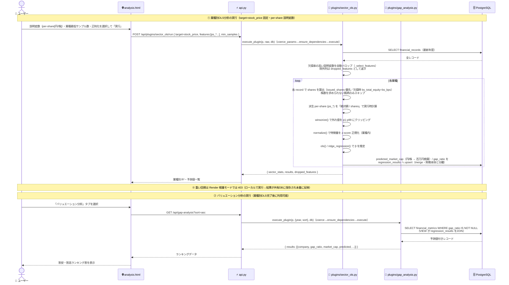

---

## 4-5. スクリーニングフロー

> 財務条件を指定して条件に合う銘柄を絞り込むフローです。

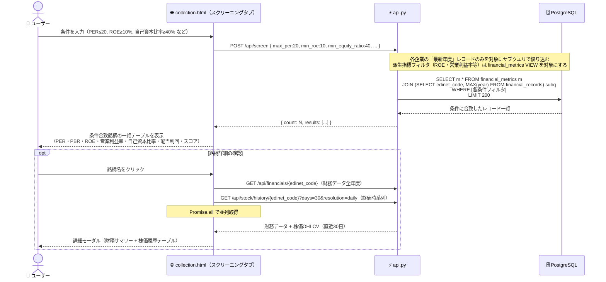

---

## 4-6. Zスコア正規化（financial_metrics VIEW で都度算出）

> 年度ごとに業界内での相対位置（偏差値に近い概念）を計算する。**事前計算・永続化は廃止**し、
> `financial_metrics` VIEW が読み取り時に SQL の window function で都度算出する（関数型）。

**VIEW 内の算出ロジック**（旧 `_calc_zscore_for_year` と同一・年度をまたがない）:
- 対象指標（`pl_revenue`, `op_margin`, `roe`, `equity_ratio`, `cf_ratio`, `pl_eps`, `de_ratio`, `nc_ratio`）ごとに
  `Z = (値 − AVG(値) OVER (PARTITION BY year)) / COALESCE(NULLIF(STDDEV_SAMP(値) OVER (PARTITION BY year), 0), 1.0)`
- 年度内の非NULL件数が 2 未満なら NULL（`COUNT(値) OVER (PARTITION BY year) >= 2` ガード）
- 標本標準偏差・`sd=0→1.0` フォールバック・丸め桁（z は 4 桁）まで旧実装に一致させてある。

> 旧 `calc_zscore_normalization` / `calc_growth_rates` 関数は残置（非推奨・収集後の呼び出しは廃止）。
> 派生比率・成長率も同様に VIEW が算出する（成長率は `LAG() OVER (PARTITION BY edinet_code ORDER BY year, period_end)`）。

---

## 4-7. エラー・キャンセルフロー

> 収集中にエラーが発生した場合、またはユーザーが停止ボタンを押した場合の挙動です。

| ケース | 発生条件 | 動作 |
|---|---|---|
| **① 手動停止** | ユーザーが「停止」ボタン | `POST /api/collect/stop` → `jobs.request_cancel("collection")` → BGT が次ループ先頭の `cancel_check()` で検出 → 処理済み分を `DB.commit()` → `collection_logs.status="done"` → `running=False` → SSE → UI 表示 |
| **② 1件単位エラー** | EDINET API / XBRL パースの例外 | `except` でスキップしてループ継続（`log.warning`）。収集自体は止まらない |
| **③ 重大エラー** | 予期しない例外でループ全体停止 | `collection_logs.status="error"`・`message=str(e)` → `running=False` → SSE → UI にエラー状態表示 |
| **④ ジョブスタック** | `finally` 未到達（強制終了等）で `running` フラグが残った | `POST /api/collect/reset-stuck`（または `smart-start { force:true }`）→ `jobs.state("collection").running=False`・DB の running ログを error 化 → 200 `{ reset_jobs: N }` |

---

## 5. 画面遷移図

> 各画面とその中のタブ構成、遷移ルートを示します。全サブページは共通の上部グローバルナビ（`.gnav`）を持つ（図の下の注記参照）。

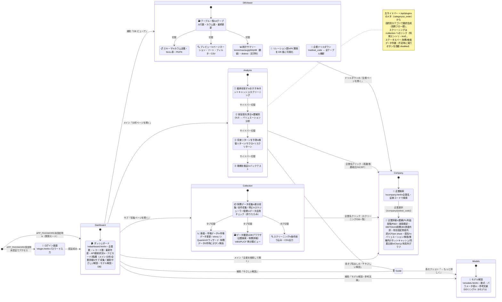

> **グローバルナビ（`.gnav`・全サブページ共通）**: ダッシュボード以外の全ページ（分析・企業詳細・収集・DB・やさしい解説・モデル解説）の上部に、同一の横断ナビ `ホーム / 分析 / 企業詳細 / 収集 ｜ やさしい解説 / モデル解説` を常設。主要4導線を左、リファレンス2件を右（`gnav-spacer` で右寄せ）に分け、現在ページは `.active`（下線）で示す。これにより「分析 → 気になった銘柄を企業詳細でドリルダウン」のような横移動がホーム経由なしで可能。収集ページのみ、この下にページ内タブ（財務データ収集 / 株価・市場 / データ確認 / スクリーニング）を別バーで持つ。

---

## 6. データ変換フロー（財務データが分析結果になるまで）

> XBRLデータが割安銘柄ランキングになるまでの変換過程を示します。

```mermaid
flowchart TD
    A["📋 EDINET\nXBRL書類（ZIP）\n有価証券報告書"]

    B["🔄 XBRLパース\nparse_xbrl_csv()\n─────────────────\nCSV内の要素名をXBRL_MAPで照合\n連結優先（NonConsolidated除外）\n前期比較データ除外（Prior含む行）"]

    C["📦 データ分類\n─────────────────\nBS: 総資産・純資産・現金など\nPL: 売上高・営業利益・純利益・EPSなど\nCF: 営業CF・投資CF・財務CFなど"]

    E["🗄️ DB保存（ソースのみ）\nupsert_financial()\n─────────────────\n(edinet_code, year, period_end)\nで重複チェック → 存在すれば更新\n※派生指標は保存しない（derived 取り込み廃止）"]

    F["📈 株価取得\nstooq / J-Quants\n─────────────────\nstock_price/market_cap/per/pbr を\n収集時点スナップショットとして保存"]

    D["🧮 派生指標（永続化しない）\nfinancial_metrics VIEW\n─────────────────\nROE・営業利益率・自己資本比率・D/E・CF比率\nネットキャッシュ・各Zスコア・前期比成長率を\nソース列から都度SQL算出（関数型）"]

    I["🧩 業種別OLS分析（重い・ローカル実行）\nplugins/sector_ols.py\n─────────────────\n業種ごとに個別OLS／winsorize/z-score前処理\n→ predicted/gap を regression_results へ保存\n（Render軽量モードでは403）"]

    J["🎯 バリュエーション分析\nplugins/gap_analysis.py\n─────────────────\nfinancial_metrics VIEW（regression_results JOIN）から\ngap_ratio を読み取り→割安度/AR(1)半減期/期待総リターン"]

    K["🏆 割安銘柄ランキング\nanalysis.html\n─────────────────\n乖離率の小さい順に表示\n収束スコア・半減期は参考値として表示"]

    A --> B --> C --> E --> F --> D --> I --> J --> K

    style A  fill:#1e3a5f,color:#93c5fd
    style E  fill:#052e16,color:#86efac
    style D  fill:#1c1400,color:#fcd34d
    style K  fill:#2e1065,color:#c4b5fd
```

---

## 7. プラグインシステム（クラス図）

> 分析機能を差し込み式（プラグイン）で拡張できる構造を示します。

```mermaid
classDiagram
    class AnalysisPlugin {
        <<abstract>>
        +str name
        +str label
        +str description
        +list depends_on
        +bool heavy
        +str category
        +int ui_order
        +params_schema() dict
        +execute(params, db) dict
        +to_meta() dict
    }

    class GapAnalysisPlugin {
        +name = "gap_analysis"
        +label = "バリュエーション分析"
        +depends_on = ["sector_ols"]
        +params_schema() 年度・ソート順・最低配当利回り
        +execute() gap_ratio→割安度/半減期/期待総リターン
    }

    class RecommendPlugin {
        +name = "recommend"
        +label = "推薦スクリーニング"
        +depends_on = []
        +params_schema() プリセット選択・指標ウェイト
        +execute() 複合スコアでランキング生成
    }

    class SectorOLSPlugin {
        +name = "sector_ols"
        +label = "業種別OLS分析"
        +depends_on = []
        +heavy = True
        +params_schema() 業種選択・説明変数
        +execute() 業種内OLS→regression_results へ保存
    }

    class NetCashAnalysisPlugin {
        +name = "net_cash_analysis"
        +label = "ネットキャッシュ分析"
        +depends_on = []
        +params_schema() NC比率下限/上限・NCAV比率・営業CF/純利益フィルタ・時価総額・業種・年度
        +execute() 清原式NC比率＋グレアムNCAV比率でランキング生成（OLS不使用・品質ガード/トラップ除外付き）
    }

    class MacroRiskReturnPlugin {
        +name = "macro_risk_return"
        +label = "マクロ×リスク-リターン推奨"
        +depends_on = []
        +heavy = True
        +ui_order = 330
        +params_schema() lambda_risk/risk_axis/fin_features(価格フリー含む)/use_macro/macro_features(USDJPY/SP500/US10Y/NIKKEI225 multiselect)/top_n 等
        +execute() 交差項OLS(財務×マクロ)+LassoLarsIC(BIC)選択+OLS再フィット+Walk-forward CV+James-Stein縮小。全社raw+selected_features+feature_coefs(標準化係数)を返却(効用U/Pareto/top_nはJS後処理)
    }

    class PluginRegistry {
        -dict _registry
        +_load() プラグインファイルを自動スキャン
        +get_plugin(name) AnalysisPlugin
        +list_plugins() list
        +ensure_dependencies(plugin, db) depends_on 強制
        +execute_plugin(plugin, raw, db) coerce→ensure→execute の単一入口
    }

    class Utils {
        <<module>>
        +coerce_params(schema, raw) typed params : パラメータ契約の coerce seam
        +ols(X, y) coefficients, r2
        +normalize(values, method) normalized_values
        +winsorize(values, p_low, p_high) clipped_values
        +walk_forward_cv(X, y, n_splits) cv_metrics
        +fit_feature_columns(X, n_feat) win_params, norm_params
        +transform_feature_row(sample, win_params, norm_params) list
    }

    AnalysisPlugin <|-- GapAnalysisPlugin
    AnalysisPlugin <|-- RecommendPlugin
    AnalysisPlugin <|-- SellRankingPlugin
    AnalysisPlugin <|-- SectorOLSPlugin
    AnalysisPlugin <|-- NetCashAnalysisPlugin
    AnalysisPlugin <|-- MacroRiskReturnPlugin
    AnalysisPlugin <|-- MacroGbdtPlugin
    AnalysisPlugin <|-- MacroDlmPlugin

    PluginRegistry --> AnalysisPlugin : 管理・呼び出し

    GapAnalysisPlugin     --> Utils : 統計処理を使用
    SectorOLSPlugin       --> Utils : ols() / winsorize() / normalize() を使用
    MacroRiskReturnPlugin --> Utils : ols() / winsorize() / walk_forward_cv_monthly(return_residuals) / get_macro_features() を使用

    note for SectorOLSPlugin "heavy=True: Render 軽量モードでは\nrun_plugin が 403 を返しローカル実行を促す\n（結果は regression_results に保存され本番へ反映）"
    note for GapAnalysisPlugin "業種別OLSの実行後でないと\nregression_results が空のため結果が出ない\n（financial_metrics VIEW 経由で gap_ratio を読む）"
    note for NetCashAnalysisPlugin "清原達郎『わが投資術』式\nNC = 流動資産 + 投資有価証券×0.7 − 総負債\nOLS不使用・会計値からの直接計算"
    note for MacroRiskReturnPlugin "交差項OLS+LassoLarsIC(BIC)選択+OLS再フィット+walk-forward CV+James-Stein縮小\nリスク軸 R1/R2/R3 を risk_axis で切替（効用U/Pareto/top_nはクライアント側後処理＝即時切替）\n期待リターン基準は μ_raw（μ_shrunk は低シグナル時に全社セクター平均へ潰れるため表の参考列のみ）。散布図は全社描画＋効用上位N強調・両軸[p1,p99]固定（効用上位Nのみだとリスク方向に潰れるため）\n（R3=セクター×サイズ別バケットの CV 残差 RMSE・サイズ代理 bs_total_assets）\nマクロ計算は日付メモ化で高速化（既定219s→29s）\nheavy=True / use_macro=False で純財務モデルにも縮退"
    note for AnalysisPlugin "params_schema() はパラメータ契約（CONTEXT.md）:\ntype=ウィジェット / dtype=データ型 の2軸。\nexecute は coerce 済み typed params を受け取り、\n意味的 validation だけ持つ（型変換・default・\nbounds/membership は coerce_params が担う）"
    note for Utils "統計は numpy / scipy / statsmodels / sklearn を使用。\ncoerce_params（パラメータ契約の coerce seam）と\nwalk_forward_cv_monthly() を含む"
```

---

## 8. REST API エンドポイント一覧

> このツールが提供する全APIエンドポイントの一覧です。

```mermaid
graph LR
    subgraph PAGE["📄 ページ配信"]
        P1["GET /\ndashboard.html を返す"]
        P2["GET /collection\ncollection.html を返す"]
        P3["GET /analysis\nanalysis.html を返す"]
        P4["GET /login\nlogin.html を返す"]
        P5["GET /models\nmodels.html を返す\n（モデル解説・参考文献）"]
        P5g["GET /guide\nguide.html を返す\n（初心者向けやさしい解説）"]
        P6["GET /db\ndb.html を返す\n（DBビューア）"]
        P7["GET /company\ncompany.html を返す\n（企業検索）"]
        P8["GET /company/{edinet_code}\ncompany.html を返す\n（個別企業の業績・財務・CF可視化）"]
    end

    subgraph OPS["🩺 運用"]
        H1["GET /health\n死活監視（DB疎通確認、認証不要）\n200=ok / 503=degraded"]
        H2["GET /api/system/info\nRENDER_LIGHT_MODE フラグを返す\n（フロントが heavy プラグイン可否を判定）"]
    end

    subgraph AUTH["🔐 認証 /api/auth/"]
        A1["POST /api/auth/login\nパスワード認証 → HttpOnly Cookie + CSRF Cookie 発行"]
        A2["POST /api/auth/reset-password\n回復キーでパスワード変更"]
        A3["GET /api/auth/status\n認証が必要かどうかを返す"]
        A4["POST /api/auth/logout\n認証Cookieを削除"]
    end

    subgraph STATS["📊 統計 /api/stats"]
        S1["GET /api/stats\n企業数・レコード数・最新年度\n+ データ鮮度（最終更新日時・経過日数・期待最新年度・freshness判定）"]
        S2["GET /api/companies\n企業一覧（検索・業種・市場フィルタ）"]
        S3["GET /api/financials/{edinet_code}\n指定企業の全年度財務データ"]
        S4["GET /api/stock/history/{edinet_code}?resolution=daily|weekly\n終値時系列（close-only・daily=直近6か月/weekly=全履歴）"]
        S5["GET /api/export/csv\n財務データをCSVでダウンロード"]
    end

    subgraph COLLECT["📦 収集管理 /api/collect/"]
        C1["POST /api/collect/start\n財務データ収集を開始"]
        C2["POST /api/collect/stop\n財務データ収集を停止"]
        C3["GET /api/collect/stream\nSSE: 収集進捗をリアルタイム配信"]
        C4["GET /api/collect/status\n直近ジョブの状態確認"]
        C5["POST /api/collect/refresh/{edinet_code}\n1社だけ再取得"]
        C6["POST /api/collect/market-data\n株価データ更新を開始"]
        C7["POST /api/collect/market-stop\n株価更新を停止"]
        C8["GET /api/collect/market-stream\nSSE: 株価更新進捗"]
        C9["GET /api/collect/market-data/status\n株価更新の状態"]
        C10["POST /api/collect/history/start\n株価履歴収集を開始"]
        C11["POST /api/collect/history/stop\n株価履歴収集を停止"]
        C12["GET /api/collect/history/stream\nSSE: 株価履歴収集進捗"]
        C13["GET /api/collect/history/status\n株価履歴収集の状態"]
        C14["GET /api/collect/history/coverage\n収集済み社数・レコード数"]
        C14b["POST /api/collect/jquants/start\nJ-Quants日次データ収集（上書き更新）"]
        C14c["POST /api/collect/jquants/stop\nJ-Quants収集を停止"]
        C14d["GET /api/collect/jquants/stream\nSSE: J-Quants収集進捗"]
        C14e["GET /api/collect/jquants/status\nJ-Quants収集の状態"]
        C15["GET /api/collect/edinet-coverage\nEDINET収録状況"]
        C16["GET /api/collect/market-coverage\n株価データ収録状況"]
        C17["GET /api/collect/data-quality\nNULL率・外れ値チェック\n会計基準別サマリ（JGAAP/IFRS/US-GAAP）"]
        C18["POST /api/collect/industry\nJPX Excelから業種データを更新"]
        C19["POST /api/collect/macro/start\nマクロデータ収集（為替・金利・指数・コモディティ）"]
        C20["POST /api/collect/macro/stop\nマクロ収集を停止"]
        C21["GET /api/collect/macro/status\nマクロ収集の状態"]
        C22["GET /api/collect/macro/stream\nSSE: マクロ収集進捗"]
        C23["POST /api/collect/reparse/start\nxbrl_raw_documentsから再解析（EDINET通信なし）\nRender可・年度/EDINETコードフィルタ対応"]
        C24["POST /api/collect/reparse/cancel\n再解析を停止"]
        C25["GET /api/collect/reparse/stream\nSSE: 再解析進捗"]
        C26["POST /api/collect/smart-start\nスマート収集（DB状態から自動判定）"]
        C27["POST /api/collect/reset-stuck\nスタックしたrunningジョブを強制リセット"]
    end

    subgraph MACRO["🌐 マクロデータ /api/macro/"]
        MA1["GET /api/macro/series\n系列カバレッジ一覧（件数・最古日・最新日）"]
        MA2["GET /api/macro/data/{series_code}\n指定系列の日次データ（OHLCV）"]
    end

    subgraph SCHED["🖱️ 手動差分収集 /api/scheduler/"]
        SC3["POST /api/scheduler/run-now\n差分収集を手動実行\n（過去1年・skip_existing）"]
    end

    subgraph ANALYSIS["📊 分析 /api/"]
        AN1["GET /api/plugins\nプラグイン + 特例エントリ(screen/backtest)のメタ一覧\n（category/ui_order/heavy 含む・ui_order 昇順）"]
        AN2["POST /api/plugins/{name}/run\nプラグインを実行\n（heavy かつ RENDER_LIGHT_MODE は 403）"]
        AN11["GET /api/plugins/{name}/tuned\n自動調整済みハイパーパラメータ\n（hyperparameter_search.py --persist が書込・未調整は404）\n読取専用・軽量"]
        AN10["GET /api/model/status\n業種別OLSモデルの鮮度情報\n（computed_at/staleness_days/n_results/is_stale）\n鮮度バーUI用の軽量GET"]
        AN4["GET /api/gap-analysis\nバリュエーション分析（旧互換エンドポイント）"]
        AN5["POST /api/screen\nスクリーニング（条件絞り込み）"]
        AN6["GET /api/recommend/presets\n推薦プリセット一覧"]
        AN7["POST /api/recommend\n推薦スクリーニング実行"]
        AN8["GET /api/backtest\n過去スコアリングの実績リターン検証\n?preset&months_ago&top_n&source / summary+percentiles"]
        AN9["GET /api/backtest/multi\n複数保有期間（3/6/12/18/24ヶ月）一括比較\n?preset&top_n&source"]
    end

    subgraph DBV["🗃️ DBビューア /api/db/"]
        DB1["GET /api/db/tables\n全テーブルの行数・カラム数・最終更新"]
        DB2["GET /api/db/schema/{table}\nカラム定義・NULL率・PK/FK"]
        DB3["GET /api/db/preview/{table}\n行プレビュー（ページネーション・ソート・フィルタ）"]
        DB4["GET /api/db/stats/{table}\n統計サマリー（min/max/avg/p50/p99/distinct）"]
        DB5["GET /api/db/relations\nテーブル間FKリレーション一覧"]
        DB6["GET /api/db/company/{edinet_code}\n企業別ドリルダウン（全テーブル横断）"]
        DB7["GET /api/db/export/{table}\nテーブルをCSVでダウンロード（フィルタ対応）"]
    end
```

---

## 9. デプロイ構成図

> **稼働中の本番環境**: Render（Web Service）+ Supabase（PostgreSQL）。
> 詳細な運用ガイドは [docs/DEPLOYMENT.md](DEPLOYMENT.md) を参照。

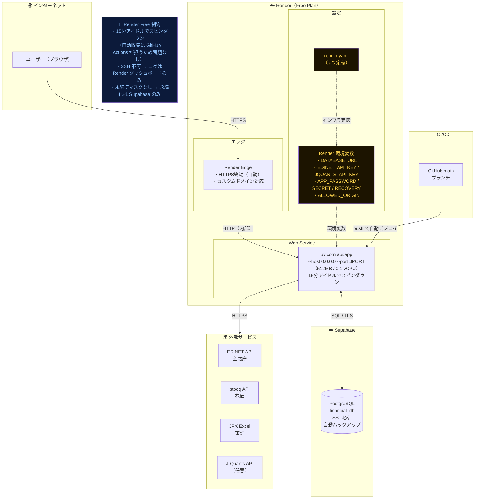

---

## 10. ファイル役割一覧

| ファイル | 種別 | 役割 | 主な依存先 |
|---|---|---|---|
| `api.py` | バックエンド | FastAPI アプリ本体。REST ルートは `routers/` 4本へ分割し `include_router` で集約。自身は HTML ページ配信・`/health`・`/api/system/info`・ミドルウェア（認証/CORS）・`StaticFiles` マウントを担う。収集ジョブの実行時状態は `collection_jobs.jobs` registry、バックテスト計算は `backtest`、財務レコード整形は `serializers` へ委譲 | routers/*, database.py, collector.py, collection_jobs.py, backtest.py, serializers.py, plugins/ |
| `routers/*.py` | バックエンド | `api.py` が `include_router` で束ねる REST ルーター4本（いずれも `APIRouter()`・フルパス保持）。`auth`（認証・Cookie/CSRF 発行）/ `collect`（収集管理・進捗SSE）/ `market`（統計・企業一覧・株価/履歴・マクロ・CSV）/ `analysis`（プラグイン実行・推薦・乖離・スクリーニング・バックテスト・DBビューア）。REST ルート定義の実体はここにある | database.py, collection_jobs.py, plugins/, data_quality.py |
| `collection_jobs.py` | バックエンド | 収集ジョブの実行時状態を集約する registry。job 名キーの `JobState`（running/progress/log/cancel）＋ start/cancel/snapshot/stream を提供。旧6本の並列 status dict を1箇所に畳む。SSE 配信ジェネレータ（`_sse_stream`）を内包 | fastapi |
| `backtest.py` | バックエンド | バックテスト分析（スコアリング上位N社の実績リターン）。`run(db, …, source)->dict` / `score_record` / `percentile` / `SCORING_SOURCES`(`recommend`/`valuation`/`net_cash`/`sell`) / `MULTI_PERIODS`。`source` で検証対象の一次分析を切替（メタ層の一般化）。`sell`＝買い系スコアの符号反転（双対）で超過収益が負なら有効。FastAPI 非依存で直接テスト可能。スコア指標は `FinancialMetric`（VIEW 派生）を引く | database.py, plugins.recommend, plugins.net_cash_analysis |
| `serializers.py` | バックエンド | 財務レコード（`FinancialMetric`）を bs/pl/cf/val/nc/zscore のネスト dict へ整形する純粋関数 `record_to_dict` | — |
| `database.py` | バックエンド | DBテーブル定義・upsert。8テーブル（Company / FinancialRecord / StockPriceDaily / StockPriceWeekly / MacroData / CollectionLog / XbrlRawDocument / **RegressionResult**）＋ **`financial_metrics` VIEW**（派生指標を都度SQL算出・読み取り専用 ORM `FinancialMetric`）。`upsert_financial` は **ソース列のみ**保存（derived 取り込み廃止）。`upsert_regression_result`（merge・方言非依存）。派生指標は VIEW へ移行し旧 `calc_growth_rates`/`calc_zscore_normalization` は削除、旧計算列は `init_db` の冪等 `DROP COLUMN` で除去。`pack_elements`/`unpack_elements`/`upsert_xbrl_raw` ヘルパを含む | PostgreSQL |
| `collector.py` | バックエンド | **オーケストレータ＋後方互換の再エクスポート層**（88行）。CLI エントリ（`python collector.py ...`）を保持し、責務別4モジュールの全シンボルを再エクスポートする（`from collector import X` / `collector.X` は従来どおり）。実体は下記4ファイル | collector_utils/master/financials/prices |
| `collector_utils.py` | バックエンド | 収集系モジュール共通の設定定数（EDINET/J-Quants/Yahoo/stooq のレート・並列数・バッチ閾値）とロガー `log` | dotenv |
| `collector_master.py` | バックエンド | 企業/業種マスタ収集（EDINET コードリスト `fetch_edinet_code_list`・JPX 業種マスタ `update_industry_from_jpx` / `_read_jpx_excel`） | EDINET API, JPX, collector_utils |
| `collector_financials.py` | バックエンド | XBRL 財務収集・パース・正規化（`parse_xbrl_csv` / `calc_derived` ほか）＋ CF/PL-BS 補完・再解析＋全件収集オーケストレーション（`run_full_collection` / `_phase_*`）。**派生指標・Zスコア・成長率・nc_ratio は永続化しない**（financial_metrics VIEW が担う）。`calc_derived` は free_cf/nonoperating_income の算出のみ残す | EDINET API, collector_utils, collector_master |
| `collector_prices.py` | バックエンド | 株価収集（stooq / J-Quants / Yahoo）＋市場データ更新＋マクロ指標収集。株価は J-Quants が主経路（stooq は Azure IP ブロックのためローカル補助のみ）。`MACRO_SERIES` で為替・金利・指数・コモディティ・ボラ13系列、`FRED_SERIES` で FRED 9系列（米クレジット/インフレ＋#250 日本実体経済4種）、`BOJ_SERIES` で日銀 API 5系列（M2 月次＋短観DI 4バリアント・四半期・認証不要）、`ESTAT_SERIES` で e-Stat API 3系列（全国CPI総合/コア・東京CPI・`ESTAT_API_KEY` 要）を定義。公表ラグは各系列の `lag_days` で `trade_date` をシフトして先読みバイアスを防ぐ。TOPIX は指数 ^TPX 配信停止のため ETF 1306.T で収集（#250） | J-Quants, Yahoo, stooq, FRED, 日銀API, e-Stat, collector_utils |
| `data_quality.py` | バックエンド | データ品質チェック（NULL率・外れ値・収録状況） | database.py, api.py（import元） |
| `plugins/base.py` | バックエンド | 分析プラグインの抽象基底クラス | — |
| `plugins/__init__.py` | バックエンド | プラグインを自動スキャン・レジストリ管理 | plugins/*.py |
| `plugins/gap_analysis.py` | バックエンド | バリュエーション分析（割安度＋AR(1)半減期＋期待総リターン）。gap_ratio は financial_metrics VIEW（regression_results をJOIN）から読む。期待総リターン＝gap_ratio＋配当利回り、implied PER/PBR＝予測株価÷EPS/BPS（旧 total_return を吸収）。内部 slug・`/api/gap-analysis` は後方互換で維持・表示ラベルは「バリュエーション分析」 | plugins/utils.py |
| `plugins/recommend.py` | バックエンド | 複合スコアによる銘柄推薦（z_roe 等 financial_metrics VIEW 8指標＋z_momentum）。z_momentum のみ VIEW 外の実行時計算（`compute_momentum_z`）で、候補集団の `StockPriceWeekly` を一括取得し `get_momentum_return`（12-1モメンタム）を winsorize+z標準化。`backtest.py` も同関数を as-of 日付付きで再利用（as-of検証のリークセーフ） | plugins/utils.py, database.py |
| `plugins/sell_ranking.py` | バックエンド | 売り候補ランキング（保有銘柄の売り時）。買い系の逆観点（割高度 gap_ratio 反転・業績悪化・**ネットキャッシュ余力 nc_ratio 毀損**・価格モメンタム）を最新年度ユニバースで winsorize+z 標準化して合成し、相対ランキング＋SELL/REDUCE/HOLD 絶対ラベル（トレンド補正）を付与。`nc_ratio` は VIEW 列でなく `_resolve_metric` が実行時計算（net_cash_analysis の compute_* を再利用）。保有は都度入力（サーバ非保存）・購入単価は損益表示のみ。`depends_on=["sector_ols"]`（gap_ratio 用）。価格モメンタムは stock_price_weekly。**μ／−R_macro 観点の出所は `mu_source` トグル（既定 M-1 `macro_risk_return`／M-2 `macro_gbdt`）で切替**——選択 producer の `read_producer_scores` を読み、未実行なら graceful-degrade（`mu_available=false`）。M-2 選択時は r1_prime 不在で R3 足切りゲート無効（ADR-0004） | plugins/utils.py, database.py, plugins.net_cash_analysis |
| `plugins/sector_ols.py` | バックエンド | 業種別OLS回帰分析（次元整合・winsorize+z-score前処理）。`heavy=True`（Render 軽量モードで 403）。予測値は regression_results へ保存 | plugins/utils.py |
| `plugins/net_cash_analysis.py` | バックエンド | ネットキャッシュ分析（清原達郎『わが投資術』式）＋グレアムNCAV。NC = 流動資産 + 投資有価証券×0.7 − 総負債、NCAV = 流動資産 − 総負債。推計時価総額の崩れによる異常比率はサニティ上限で自動除外し、任意で営業CF>0等のバリュートラップ除外も可能 | database.py |
| `plugins/macro_snapshots.py` | バックエンド | M-1/M-2 共有スナップショット構築モジュール（ADR-0003 §3）。`_MACRO_MAP` 正本・`build_snapshots`（`build_interactions`／`macro_nan_ok` フラグ。後者=M-2 専用でマクロ欠損を NaN 保持＝企業を落とさず XGBoost に委ねる／`return_stock_ids`=ADR-0002 M-1' per-stock 階層ベイズ専用で観測ごとの edinet_code を追加返却）・`load_data`・`preload_macro`・`_realized_vol`・`select_features_bic`（pooled BIC 選択の共有実体。`macro_risk_return._select_macro_features` と `macro_beta_inference.select_shared_factors` が共用）・`producer_scores`/`get_producer_scores`・**`oof_backtest`（アウトオブサンプル検証ヘルパ・ADR-0004）** を集約。M-2→M-1 結合ゼロ | plugins/utils.py |
| `plugins/tuning.py` | バックエンド | M-1/M-2/M-3 共有ハイパーパラメータ自動探索エンジン（ADR-0007・Issue #264）。`SearchDim`（探索軸・`only_if`で条件付き軸を values[0]へ縮退）から grid/random で候補を生成し、各候補を `execute_plugin` でフル実行して `oof_backtest` から目的関数（`rank_ic`/`ic_ir`/`long_short`）スコアを抽出する `search()`。M-2/M-3 の producer 永続化は `database.tuning_dry_run()` で候補評価中のみ抑止 | plugins/utils.py, plugins/__init__.py, database.py |
| `plugins/macro_risk_return.py` | バックエンド | M-1 マクロ×リスク-リターン推奨（交差項OLS+`LassoLarsIC(BIC)`選択+OLS再フィット+Walk-forward CV）。**全社rawを返却しJS後処理**。`heavy=True`。共有ロジックは `macro_snapshots.py` に移管（ADR-0003）。**`oof_backtest` 結線済み（#272）**・`tuning_search_space()`（use_macro/use_momentum/momentum_window/min_coverage/max_features の少数軸グリッド・#265） | plugins/utils.py, macro_snapshots.py |
| `plugins/macro_gbdt.py` | バックエンド | M-2 マクロ×財務 勾配ブースティング（ADR-0003 / ADR-0004 / #234）。XGBoost が交互作用を自動学習。同一 fold で OLS ベースライン比較・SHAP グローバル+per-stock 全社添付。**`oof_backtest`（アウトオブサンプル検証＝無リーク OOF 予測の分位/rank-IC/LS/hit-rate）を返却**し、**per-stock μ̂ を `macro_gbdt_scores` へ全置換で永続化**（producer）。`produced_output`/`read_producer_scores`（M-1 と同一形）で売り推奨が `mu_source` 経由で読む。`tuning_search_space()`（XGBoost 7軸・ランダムサーチ既定・#266）。`heavy=True`・`ui_order=340` | plugins/utils.py, macro_snapshots.py, xgboost, shap |
| `plugins/macro_dlm.py` | バックエンド | M-3 ベイズ状態空間モデル（時変マクロβ DLM）。銘柄ごとに週次リターンを主要マクロの週次変化へ回帰し、係数（α/β）が時間変動する動的線形モデルを自前の割引係数 DLM（West & Harrison 型・numpy）で逐次ベイズ推定。観測分散は Normal-Gamma 共役で学習し α/β の信用区間を解析的に出力。最新フィルタ α_T を年率化して µ̂ ランキング、β 経路＋1期先予測診断（校正/RMSE/カバレッジ）を返す。週次変化マクロ（`_DLM_MACRO_MAP`）は M-1/M-2 の水準 YoY/Z とは別系。`load_prices`/`load_macro_levels` で価格+マクロのみロード（財務不使用）。カバレッジ `_MIN_FACTOR_COVERAGE`（既定0.5）未満の薄い factor は自動除外し企業母集団を factor 選択から切り離す（`diagnostics.dropped_factors`/`factor_coverage`）。`tuning_search_space()`（δ/β_v は既存 `_AUTO_DELTA_GRID`/`_AUTO_BV_GRID` を再利用・alpha_phi は alpha_ar1=True 時のみ有効・#267。既存の周辺尤度 `auto_hyperparams` チェックボックスは高速フォールバックとして維持）。`heavy=True`・`ui_order=360`。初版は API/UI のみ（producer 化・sell_ranking 連携は将来） | numpy, scipy, plugins/utils.py |
| `plugins/utils.py` | バックエンド | coerce_params()・ols()・normalize()・winsorize()・walk_forward_cv()・`walk_forward_cv_monthly(fit_predict=None)`（fit_predict コールバックで OLS/XGBoost を切替可・ADR-0003 §3）・get_macro_features()・get_momentum_return()・fit_feature_columns()・transform_feature_row() | — |
| `tests/` | テスト | pytest 回帰テスト（756件）。プラグイン＋utils＋`database.py`（upsert・RegressionResult merge・derived非永続）＋`collector.py`（XBRLパース・派生指標＋ネットワーク取得を httpx MockTransport でモック）＋`api.py`（純関数・`/health`・DB-backed 読取・heavy回帰のRenderブロック）をカバー。in-memory SQLite fixture（StaticPool）／FastAPI TestClient／httpx MockTransport で検証。`financial_metrics` は SQLite では `FinancialMetric` 列定義から生成したテーブルで代替し、派生値・予測値はテストが直接注入（`make_metric`）。計算式の同値性は Postgres で別途検証。共通 fixture は `tests/conftest.py`（`db`/`make_fin`/`make_metric` 等） | pytest, sqlalchemy, fastapi, httpx |
| `tests/README.md` | テスト | テスト実行方法・fixture 方針の補足ドキュメント | — |
| `requirements-dev.txt` | 設定 | 開発・テスト専用依存（`pytest`）。本番 `requirements.txt` と分離（Render メモリ節約） | — |
| `dashboard.html` | フロントエンド | トップページ・全体サマリー（`/`） | api.py |
| `collection.html` | フロントエンド | 収集管理・スクリーニング・DBブラウザ（`/collection`） | api.py |
| `analysis.html` | フロントエンド | 分析ハブ（`/analysis`）。左サイドバーを `/api/plugins` のメタ（category/ui_order）から目的別5カテゴリ（①銘柄を探す/②割安度/③リターン予測/④検証/⑤保有を見直す）で動的生成（`buildSidebar`）。売り候補ランキング（`#tab-sell_ranking`・保有銘柄の売り時）は静的タブ＋保有入力 textarea（localStorage 記憶）。バリュエーション分析に横断分布（理論vs実績の散布図・乖離率ヒストグラム）を Chart.js で表示。スクリーニングは特例エントリとして `/collection` へリンク。動的タブの結果描画は `RESULT_RENDERERS`（plugin名→描画関数の登録制・未登録は汎用フォールバック）、CSV出力は単一の `exportCSV(name)` ディスパッチャ（`CSV_EXPORTERS` 登録制）に統一。バリュエーション分析タブに**モデル鮮度バー**（`#model-freshness-bar`）を常設 — `/api/model/status` から computed_at/staleness_days を取得して表示し、OLSロック演出を廃止 | api.py, Chart.js (CDN) |
| `login.html` | フロントエンド | 認証ログイン画面（`/login`） | api.py |
| `models.html` | フロントエンド | モデル解説・参考文献ページ（`/models`）。8モデルの数式・パラメータ・DOIリンクをインラインHTMLで表示。冒頭に**分析の3層モデル**（一次分析／双対／メタ検証・`#layers`）の枠組みを置き、本文は `guide.html` と揃えた**目的別5カテゴリ**（①銘柄を探す/②割安度/③リターン予測/④検証/⑤保有を見直す）で `cat-header` グルーピング。各モデルは `#mN` でディープリンク可能（番号表示は廃止しアンカーIDのみ維持）。旧「総合リターン予測」(`#m1`) はバリュエーション分析へ統合し削除（ADR-0001）。 | — |
| `guide.html` | フロントエンド | 初心者向け「やさしい解説」ページ（`/guide`）。各分析を数式なし・たとえ話で説明（ひとことで言うと／何が分かる／どう使う／注意点）。セクションidはプラグイン名（`recommend`/`net_cash_analysis`/`gap_analysis`/`sector_ols`/`macro_risk_return`/`macro_dlm`/`backtest`/`sell_ranking`/`zscore`）でディープリンク可能（`gap_analysis`=バリュエーション分析、旧 total_return は統合）。分析画面の各タブの「❓ やさしい解説」リンクから該当セクションへ飛ぶ。各セクション末尾から技術版 `/models#mN` へ相互リンク。TOC追従は `models.js` を再利用（専用JSなし）。 | — |
| `db.html` | フロントエンド | DBビューア（`/db`）。4テーブルのスキーマ・プレビュー・統計サマリー・ER 風リレーション・企業ドリルダウン・CSV エクスポート。 | api.py |
| `company.html` | フロントエンド | 企業詳細（`/company`・`/company/{edinet_code}`）。個別企業の業績・財務(BS)・CF・per-share/配当・バリュエーション（理論時価総額乖離）・日次株価・業種内Zスコアレーダー・清原式ネットキャッシュ・同業比較を Chart.js の時系列グラフで可視化。企業名・証券コード検索付き。財務(BS)タブはバフェットコード型で各年「左＝資産（借方）／右＝負債・純資産（貸方）」を並列表示し、粒度（粗/中/細）切替で内訳の細かさを変更できる（どの粒度でも資産バー＝負債純資産バー＝総資産になるよう補正）。業績(PL)タブは売上高を費用・利益に分解した積み上げ棒（最上部＝純利益）を粒度（粗/中/細）切替で表示（合計＝売上高、信頼性の低い stored gross_profit は不使用）。CFタブも粒度（粗＝フリー+財務／中＝営業/投資/財務／細＝営業/設備投資/その他投資/財務）切替に対応し、CFデータ未収集の企業には明示メッセージを表示。同業比較タブは選択企業を必ず表示し業種内時価総額順位を併記。**相互リンク**：理論時価総額/乖離率チャート→`/analysis?tab=gap`・Zスコアチャート→`/analysis?tab=recommend`・ネットキャッシュチャート→`/analysis?tab=net_cash`（逆方向のバリュエーション分析表→`/company/{code}` は既存） | api.py, Chart.js (CDN) |
| `static/js/*.js` | フロントエンド | 各HTMLテンプレから外部化したページ別JS（CSP対応）。common（`esc`/`apiFetch`/`initAuth`/`logout` 等の共通ユーティリティ・全ページ読込）+ dashboard / collection / analysis / company / db / models / login の8ファイル。`/static` で配信（api.py の `StaticFiles` マウント）。`<style>` とインラインイベントハンドラ（`onclick=` 等）はHTML側に残置（後者は将来 addEventListener 化予定）。 | api.py |
| `_pipeline_gh.py` | GitHub Actions | 全件収集パイプライン（full-pipeline.yml から workflow_dispatch 手動起動）。`--refill-cf`（CF NULL 補完: 投資CF/現金増減/capex）・`--refill-capex-only`（capex のみワンショット）・`--refill-cf-missing`（CF全NULL社=IFRS決算大企業の営業/投資/財務CFを補完）・`--refill-pl-bs`（bs_inventory NULL 補完: 旧コホート〜2022の PL/BS 列を XBRL 再取得で是正・古い順／`refill-pl-bs.yml`）・`--diagnose-cf`（CF ラベル診断）モードを持つ。`normal` CF補完は 2026-05-31 に完了（capex 88.8%充足）、IFRS/US-GAAP決算企業の CF全NULL は 2026-06-03 に `--refill-cf-missing` で補完し CF未収集 268社→0社（詳細は GOTCHAS.md「IFRS/US-GAAP決算のCF・売上要素名」「CF NULL補完の運用」「bs_inventory バックフィルの運用」）。 | collector.py, database.py |
| `_pipeline_incremental.py` | GitHub Actions | 差分収集パイプライン（daily-incremental.yml で毎日 JST 03:00 自動実行） | collector.py, database.py |
| `_pipeline_utils.py` | GitHub Actions | 全件/差分パイプライン共通基盤。ファイルロガー生成（`make_logger`）・Supabase の read-only/一時エラー検出（`_is_readonly_error`）・指数バックオフ付きリトライラッパ（`_run_with_retry`） | collector.py |
| `edinet_ping.py` | ユーティリティ | EDINET API 疎通確認ワンショット | EDINET API |
| `scripts/check_db_state.py` | ユーティリティ | DB 状態確認ワンショット（主要6テーブルの行数＋直近の収集ログ表示）。Supabase 移行差分／パイプライン実行後の件数チェック用（手動実行） | database.py |
| `launch.py` | ユーティリティ | Windows ローカル開発用 tkinter ランチャー（uvicorn 起動 GUI）。本番・CI からは未参照の独立ツール | uvicorn |
| `macro_beta_inference.py` | GitHub Actions | ADR-0002「per-stock 階層マクロβ」の推論バッチ（`requirements-inference.txt` 対応）。全体→セクター→銘柄の二層フルベイズ階層モデル（PyMC・NUTS・non-centered パラメータ化）を `build_panel`（`plugins/macro_snapshots.py` のデータ経路を再利用）→`select_shared_factors`（pooled BIC・`select_features_bic` 共有）→`build_hierarchical_model`→`persist` で実行し、`macro_beta_loadings`/`macro_beta_meta` へ永続化する。収束診断（r_hat/ESS/発散数）は hyperparams に保存。`plugins/macro_risk_return.py`（producer/consumer）から参照。`macro-beta-inference.yml`（workflow_dispatch 手動実行）で起動 | database.py, plugins/macro_snapshots.py, plugins/macro_risk_return.py |
| `hyperparameter_search.py` | ユーティリティ | M-1/M-2/M-3 ハイパーパラメータ自動探索CLI（ローカル専用・ADR-0007・Issue #264）。`--model`（3モデルいずれか）の `tuning_search_space()` を `plugins/tuning.py::search()` で評価し、`--persist` で best params を `plugin_tuned_params` へ永続化、`--persist-scores` 併用で最終 `execute_plugin` を1回実行し producer スコアを実反映する。新規 pip 依存なし（`requirements-inference.txt` 分離は不要） | database.py, plugins/tuning.py |
| `.env` | 設定 | APIキー・DB接続・認証情報（UTF-8 BOMなし） | — |
| `docs/ARCHITECTURE.md` | ドキュメント | 本ファイル。コード変更時は必ず更新する | — |
| `docs/MODELS.md` | ドキュメント | 分析モデルの数式・パラメータ・参考文献（Markdown版）。モデル変更時は `models.html` とセットで更新する。 | — |
| `docs/FUTURE_TASKS.md` | ドキュメント | Issue 運用ガイド＋設計制約（残タスクの正本は GitHub Issues。本書はタスク実体を持たない）。完了項目は `archive/IMPROVEMENTS.md` へ集約 | — |
| `docs/archive/` | ドキュメント | 完了済み作業記録（REFACTORING・IMPROVEMENTS・VISUALIZATION_IMPROVEMENTS）。現行参照には使わない | — |
| `docs/reviews/` | ドキュメント | 分析モデル等の設計レビュー記録（ADR 化前の検討メモ。`2026-06-26-m2-macro-gbdt-review.md`・`2026-06-27-web-api-auth-input-validation-review.md` 等）。現行参照には使わない | — |
| `docs/VISION.md` | ドキュメント | プロジェクトの目的・方針 | — |
| `CONTEXT.md` | ドキュメント | ドメイン用語集（再分類項目・分析特徴量・表示項目・パラメータ契約の用語定義）。CLAUDE.md 設計制約から参照 | — |
| `docs/adr/*.md` | ドキュメント | ADR（Architecture Decision Record）。`0001`＝バリュエーション統合とバックテスト一般化（旧 total_return→gap_analysis 吸収）／`0002`＝M-1 per-stock 階層マクロβ／`0003`＝M-2 マクロ×財務 GBDT／`0004`＝M-2 downstream（売り推奨・OOF バックテスト）／`0005`＝price_predictor 削除・③リターン予測を比較ファミリーへ集約／`0006`＝日本マクロ指標 e-Stat/日銀コネクタ設計 | — |
| `CLAUDE.md` | 設定 | Claude Codeへの動作指示（索引＋必須ルール） | — |
| `.claude/agents/financial-app-explorer.md` | 設定 | read-only 探索サブエージェント定義（多ファイル調査・大ドキュメント精読をトークン節約で委譲） | — |
| `.claude/skills/*/SKILL.md` | 設定 | プロジェクト固有スキル（`/tidy` 軽量化点検 等）＋汎用スキル群。索引・各スキルの説明は [SKILLS_AND_AGENTS.md](SKILLS_AND_AGENTS.md) を参照 | — |
