# 日本株財務分析ツール — 完全アーキテクチャ図

> **閲覧方法**: VS Code に「Markdown Preview Mermaid Support」拡張をインストールし、`Ctrl+Shift+V` でプレビューを開くと図が表示されます。

---

## 目次

1. [全体構成図（コンポーネント図）](#1-全体構成図コンポーネント図)
2. [ユースケース図](#2-ユースケース図)
3. [データベース設計（ER図）](#3-データベース設計er図)
4. シーケンス図
   - [4-1. 財務データ収集フロー](#4-1-財務データ収集フロー)
   - [4-2. 株価履歴収集フロー](#4-2-株価履歴収集フロー)
   - [4-3. 認証フロー](#4-3-認証フロー)
   - [4-4. OLS回帰分析フロー](#4-4-ols回帰分析フロー)
   - [4-5. スクリーニングフロー](#4-5-スクリーニングフロー)
   - [4-6. Zスコア正規化フロー](#4-6-zスコア正規化フロー)
   - [4-7. エラー・キャンセルフロー](#4-7-エラーキャンセルフロー)
5. [画面遷移図](#5-画面遷移図)
6. [データ変換フロー](#6-データ変換フロー財務データが分析結果になるまで)
7. [プラグインシステム（クラス図）](#7-プラグインシステムクラス図)
8. [REST API エンドポイント一覧](#8-rest-api-エンドポイント一覧)
9. [デプロイ構成図](#9-デプロイ構成図)
10. [ファイル役割一覧](#10-ファイル役割一覧)

---

## 1. 全体構成図（コンポーネント図）

> ブラウザ・サーバー・DB・外部APIの全体像と接続関係を示します。
> ローカルと Render は同一 Supabase DB を共有し、役割で使い分けます。

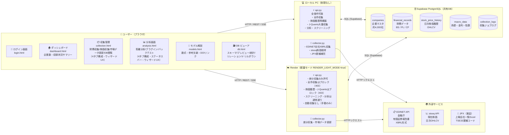

---

## 2. ユースケース図

> ユーザーがこのツールで「できること」の全体像です。

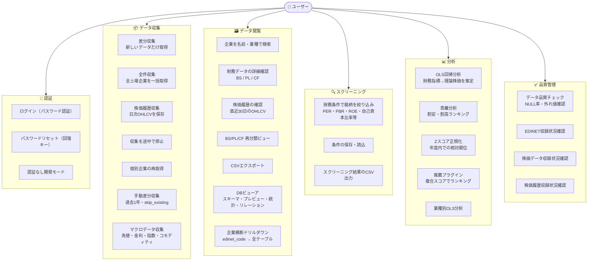

---

## 3. データベース設計（ER図）

> 5つのテーブルの構造と主要カラム、テーブル間の関係を示します。
> `||--o{` は「1対多」（1社に対して複数の財務レコードが存在する）を意味します。
> `macro_data` は企業に紐づかない独立テーブル（マクロ環境データ）です。

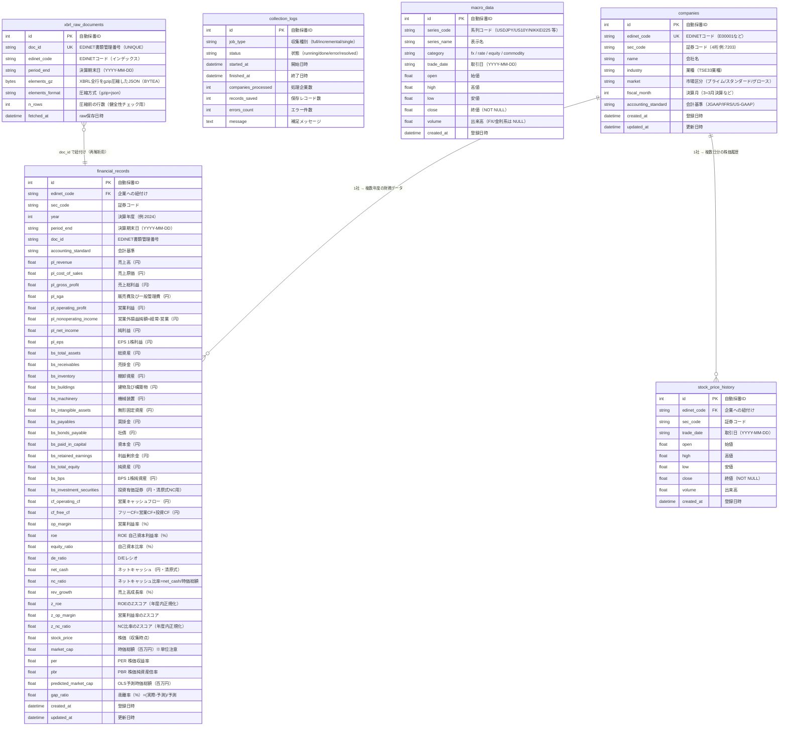

---

## 4-1. 財務データ収集フロー

> 「収集開始」ボタンから完了までの処理の流れです。

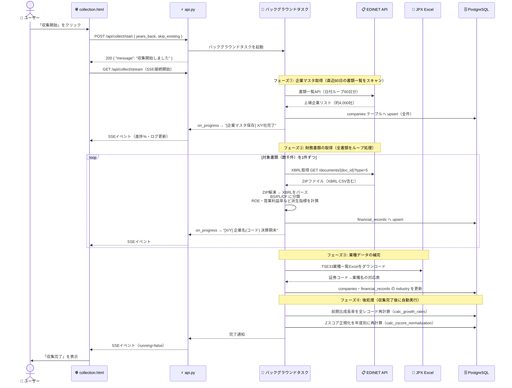

---

## 4-2. 株価履歴収集フロー

> stooq から日次OHLCV（始値・高値・安値・終値・出来高）を取得して保存するフローです。

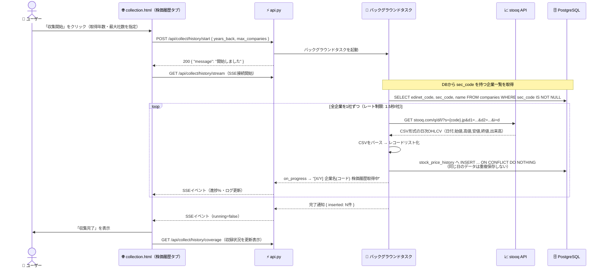

---

## 4-3. 認証フロー

> `APP_PASSWORD` が設定されている場合のみ認証が有効になります。未設定時は開発モードとして全APIが素通りします。

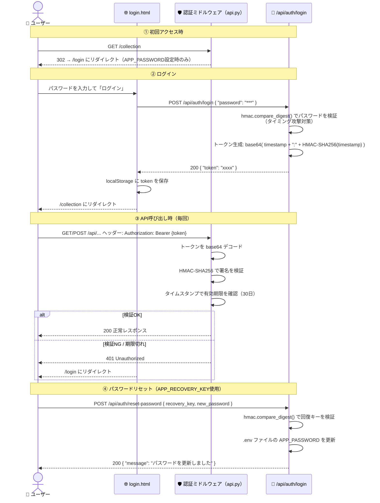

---

## 4-4. 業種別OLS分析フロー

> 業種ごとに個別OLSを実行して理論価格を推定し、乖離率（割安・割高度合い）を計算するフローです。

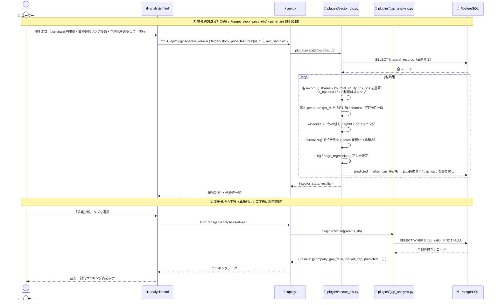

---

## 4-5. スクリーニングフロー

> 財務条件を指定して条件に合う銘柄を絞り込むフローです。

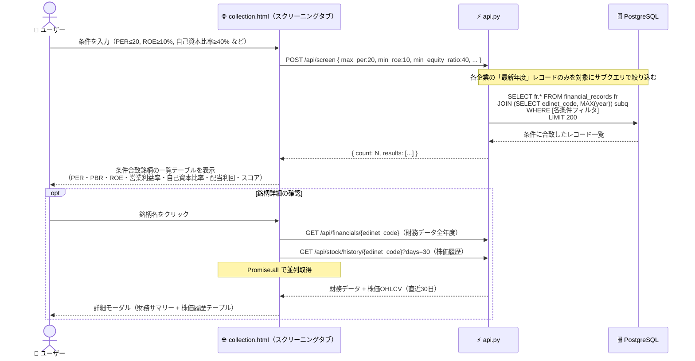

---

## 4-6. Zスコア正規化フロー

> 年度ごとに業界内での相対位置（偏差値に近い概念）を計算するフローです。

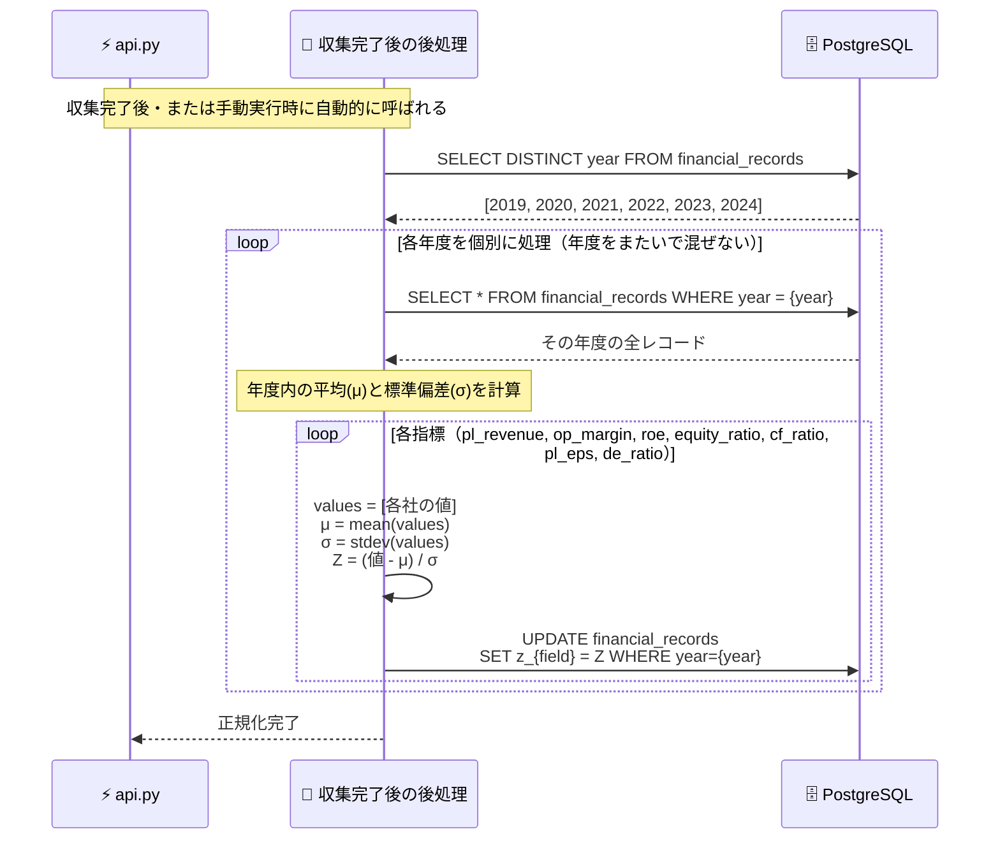

---

## 4-7. エラー・キャンセルフロー

> 収集中にエラーが発生した場合、またはユーザーが停止ボタンを押した場合の挙動です。

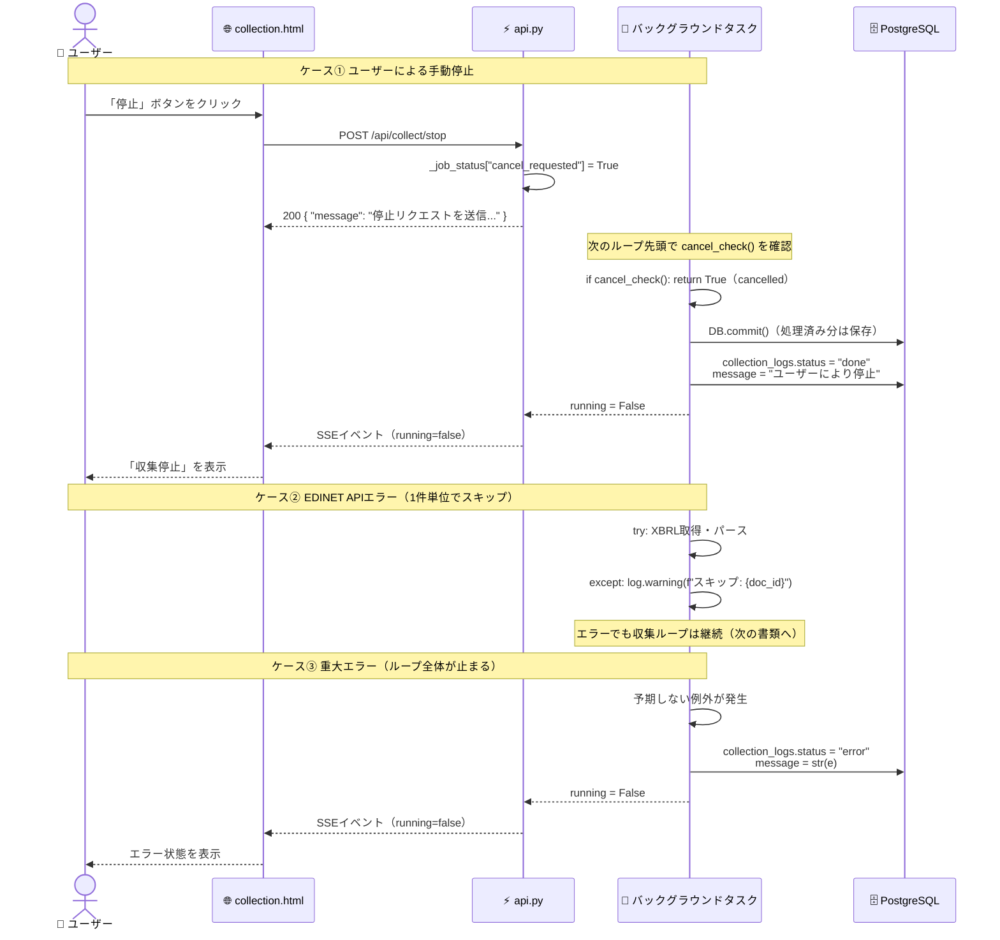

---

## 5. 画面遷移図

> 5画面とその中のタブ構成、遷移ルートを示します。

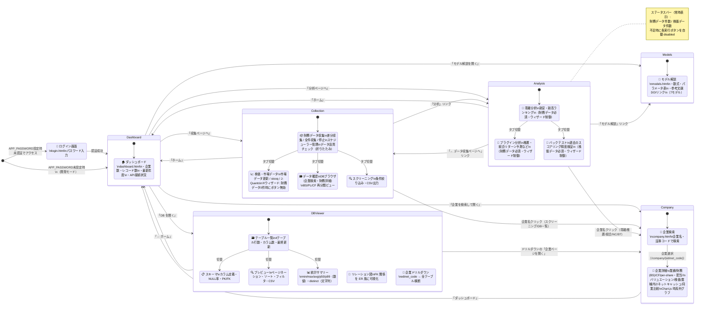

---

## 6. データ変換フロー（財務データが分析結果になるまで）

> XBRLデータが割安銘柄ランキングになるまでの変換過程を示します。

```mermaid
flowchart TD
    A["📋 EDINET\nXBRL書類（ZIP）\n有価証券報告書"]

    B["🔄 XBRLパース\nparse_xbrl_csv()\n─────────────────\nCSV内の要素名をXBRL_MAPで照合\n連結優先（NonConsolidated除外）\n前期比較データ除外（Prior含む行）"]

    C["📦 データ分類\n─────────────────\nBS: 総資産・純資産・現金など\nPL: 売上高・営業利益・純利益・EPSなど\nCF: 営業CF・投資CF・財務CFなど"]

    D["🧮 派生指標計算\ncalc_derived()\n─────────────────\nROE = 純利益 ÷ 純資産\n営業利益率 = 営業利益 ÷ 売上高\n自己資本比率 = 純資産 ÷ 総資産\nD/Eレシオ = 負債 ÷ 純資産\nフリーCF = 営業CF + 投資CF"]

    E["🗄️ DB保存\nupsert_financial()\n─────────────────\n(edinet_code, year, period_end)\nで重複チェック → 存在すれば更新"]

    F["📈 株価取得\nstooq API\n─────────────────\n株価 → PER = 株価÷EPS\n株価 → PBR = 株価÷BPS\n時価総額 = 株価×（純資産÷BPS）"]

    G["📐 前期比成長率\ncalc_growth_rates()\n─────────────────\nPostgreSQL の LAG() window function で\nedinet_code 単位の前期値と比較\n（DB 側で完結、大規模データでも OOM 回避）\n売上成長率・営業利益成長率・EPS成長率"]

    H["📊 Zスコア正規化\ncalc_zscore_normalization()\n─────────────────\n年度ごとに計算（年度混在禁止）\nZ = (値 - 年度内平均) ÷ 年度内標準偏差\nROE・営業利益率・自己資本比率など7指標"]

    I["🧩 業種別OLS分析\nplugins/sector_ols.py\n─────────────────\n業種ごとに個別OLSを実行\nwinsorize で外れ値除去（p1-p99）\nnormalize で z-score 正規化（業種内）\n→ 理論時価総額をDBに書込み"]

    J["🎯 乖離率計算\nplugins/gap_analysis.py\n─────────────────\ngap_ratio = (実際 - 予測) ÷ 予測 × 100\nマイナス → 予測より安い（割安候補）\nプラス  → 予測より高い（割高候補）"]

    K["🏆 割安銘柄ランキング\nanalysis.html\n─────────────────\n乖離率の小さい順に表示\n収束スコア・半減期は参考値として表示"]

    A --> B --> C --> D --> E --> F --> G --> H --> I --> J --> K

    style A  fill:#1e3a5f,color:#93c5fd
    style E  fill:#052e16,color:#86efac
    style H  fill:#1c1400,color:#fcd34d
    style K  fill:#2e1065,color:#c4b5fd
```

---

## 7. プラグインシステム（クラス図）

> 分析機能を差し込み式（プラグイン）で拡張できる構造を示します。

```mermaid
classDiagram
    class AnalysisPlugin {
        <<abstract>>
        +str name
        +str label
        +str description
        +list depends_on
        +params_schema() dict
        +execute(params, db) dict
        +to_meta() dict
    }

    class GapAnalysisPlugin {
        +name = "gap_analysis"
        +label = "乖離分析"
        +depends_on = ["sector_ols"]
        +params_schema() 年度・ソート順
        +execute() gap_ratio計算→ランキング生成
    }

    class RecommendPlugin {
        +name = "recommend"
        +label = "推薦スクリーニング"
        +depends_on = []
        +params_schema() プリセット選択・指標ウェイト
        +execute() 複合スコアでランキング生成
    }

    class TotalReturnPlugin {
        +name = "total_return"
        +label = "総合リターン予測"
        +depends_on = []
        +params_schema() use_cf / use_sector_fe / n_folds / top_n
        +execute() Ohlson 型 OLS + 業種固定効果（オプション）
    }

    class SectorOLSPlugin {
        +name = "sector_ols"
        +label = "業種別OLS分析"
        +depends_on = []
        +params_schema() 業種選択・説明変数
        +execute() 業種内OLS→予測値計算
    }

    class PricePredictorPlugin {
        +name = "price_predictor"
        +label = "株価リターン予測"
        +depends_on = []
        +params_schema() 予測期間・価格/財務特徴量選択
        +execute() 月次スナップショット×OLS→期待リターンランキング
    }

    class NetCashAnalysisPlugin {
        +name = "net_cash_analysis"
        +label = "ネットキャッシュ分析"
        +depends_on = []
        +params_schema() 最低NC比率・業種・最低時価総額・年度
        +execute() 清原式NC・NC比率でランキング生成（OLS不使用）
    }

    class PluginRegistry {
        -dict _registry
        +_load() プラグインファイルを自動スキャン
        +get_plugin(name) AnalysisPlugin
        +list_plugins() list
    }

    class Utils {
        <<module>>
        +ols(X, y) coefficients, r2
        +normalize(values, method) normalized_values
        +winsorize(values, p_low, p_high) clipped_values
        +walk_forward_cv(X, y, n_splits) cv_metrics
    }

    AnalysisPlugin <|-- GapAnalysisPlugin
    AnalysisPlugin <|-- RecommendPlugin
    AnalysisPlugin <|-- TotalReturnPlugin
    AnalysisPlugin <|-- SectorOLSPlugin
    AnalysisPlugin <|-- PricePredictorPlugin
    AnalysisPlugin <|-- NetCashAnalysisPlugin

    PluginRegistry --> AnalysisPlugin : 管理・呼び出し

    GapAnalysisPlugin    --> Utils : 統計処理を使用
    SectorOLSPlugin      --> Utils : ols() / winsorize() / normalize() を使用
    PricePredictorPlugin --> Utils : ols() / winsorize() / walk_forward_cv_monthly() を使用

    note for GapAnalysisPlugin "業種別OLS分析の実行後でないと\npredicted_market_capが空のため404になる"
    note for PricePredictorPlugin "StockPriceHistory + FinancialRecord を結合\n月次スナップショット × 全企業でパネルデータ構築\nルックアヘッドバイアス禁止: period_end + 45日ラグ厳守"
    note for NetCashAnalysisPlugin "清原達郎『わが投資術』式\nNC = 流動資産 + 投資有価証券×0.7 − 総負債\nOLS不使用・会計値からの直接計算"
    note for Utils "numpy / scipy は使用しない\n（純Python実装のみ）\nwalk_forward_cv_monthly() を含む"
```

---

## 8. REST API エンドポイント一覧

> このツールが提供する全APIエンドポイントの一覧です。

```mermaid
graph LR
    subgraph PAGE["📄 ページ配信"]
        P1["GET /\ndashboard.html を返す"]
        P2["GET /collection\ncollection.html を返す"]
        P3["GET /analysis\nanalysis.html を返す"]
        P4["GET /login\nlogin.html を返す"]
        P5["GET /models\nmodels.html を返す\n（モデル解説・参考文献）"]
        P6["GET /db\ndb.html を返す\n（DBビューア）"]
        P7["GET /company\ncompany.html を返す\n（企業検索）"]
        P8["GET /company/{edinet_code}\ncompany.html を返す\n（個別企業の業績・財務・CF可視化）"]
    end

    subgraph OPS["🩺 運用"]
        H1["GET /health\n死活監視（DB疎通確認、認証不要）\n200=ok / 503=degraded"]
    end

    subgraph AUTH["🔐 認証 /api/auth/"]
        A1["POST /api/auth/login\nパスワード認証 → Bearerトークン発行"]
        A2["POST /api/auth/reset-password\n回復キーでパスワード変更"]
        A3["GET /api/auth/status\n認証が必要かどうかを返す"]
    end

    subgraph STATS["📊 統計 /api/stats"]
        S1["GET /api/stats\n企業数・レコード数・最新年度\n+ データ鮮度（最終更新日時・経過日数・期待最新年度・freshness判定）"]
        S2["GET /api/companies\n企業一覧（検索・業種・市場フィルタ）"]
        S3["GET /api/financials/{edinet_code}\n指定企業の全年度財務データ"]
        S4["GET /api/stock/history/{edinet_code}\n日次株価履歴（OHLCVリスト）"]
        S5["GET /api/export/csv\n財務データをCSVでダウンロード"]
    end

    subgraph COLLECT["📦 収集管理 /api/collect/"]
        C1["POST /api/collect/start\n財務データ収集を開始"]
        C2["POST /api/collect/stop\n財務データ収集を停止"]
        C3["GET /api/collect/stream\nSSE: 収集進捗をリアルタイム配信"]
        C4["GET /api/collect/status\n直近ジョブの状態確認"]
        C5["POST /api/collect/refresh/{edinet_code}\n1社だけ再取得"]
        C6["POST /api/collect/market-data\n株価データ更新を開始"]
        C7["POST /api/collect/market-stop\n株価更新を停止"]
        C8["GET /api/collect/market-stream\nSSE: 株価更新進捗"]
        C9["GET /api/collect/market-data/status\n株価更新の状態"]
        C10["POST /api/collect/history/start\n株価履歴収集を開始"]
        C11["POST /api/collect/history/stop\n株価履歴収集を停止"]
        C12["GET /api/collect/history/stream\nSSE: 株価履歴収集進捗"]
        C13["GET /api/collect/history/status\n株価履歴収集の状態"]
        C14["GET /api/collect/history/coverage\n収集済み社数・レコード数"]
        C14b["POST /api/collect/jquants/start\nJ-Quants日次データ収集（上書き更新）"]
        C14c["POST /api/collect/jquants/stop\nJ-Quants収集を停止"]
        C14d["GET /api/collect/jquants/stream\nSSE: J-Quants収集進捗"]
        C14e["GET /api/collect/jquants/status\nJ-Quants収集の状態"]
        C15["GET /api/collect/edinet-coverage\nEDINET収録状況"]
        C16["GET /api/collect/market-coverage\n株価データ収録状況"]
        C17["GET /api/collect/data-quality\nNULL率・外れ値チェック\n会計基準別サマリ（JGAAP/IFRS/US-GAAP）"]
        C18["POST /api/collect/industry\nJPX Excelから業種データを更新"]
        C19["POST /api/collect/macro/start\nマクロデータ収集（為替・金利・指数・コモディティ）"]
        C20["POST /api/collect/macro/stop\nマクロ収集を停止"]
        C21["GET /api/collect/macro/status\nマクロ収集の状態"]
        C22["GET /api/collect/macro/stream\nSSE: マクロ収集進捗"]
        C23["POST /api/collect/reparse/start\nxbrl_raw_documentsから再解析（EDINET通信なし）\nRender可・年度/EDINETコードフィルタ対応"]
        C24["POST /api/collect/reparse/cancel\n再解析を停止"]
        C25["GET /api/collect/reparse/stream\nSSE: 再解析進捗"]
    end

    subgraph MACRO["🌐 マクロデータ /api/macro/"]
        MA1["GET /api/macro/series\n系列カバレッジ一覧（件数・最古日・最新日）"]
        MA2["GET /api/macro/data/{series_code}\n指定系列の日次データ（OHLCV）"]
    end

    subgraph SCHED["🖱️ 手動差分収集 /api/scheduler/"]
        SC3["POST /api/scheduler/run-now\n差分収集を手動実行\n（過去1年・skip_existing）"]
    end

    subgraph ANALYSIS["📊 分析 /api/"]
        AN1["GET /api/plugins\n利用可能なプラグイン一覧"]
        AN2["POST /api/plugins/{name}/run\nプラグインを実行"]
        AN4["GET /api/gap-analysis\n乖離分析（旧互換エンドポイント）"]
        AN5["POST /api/screen\nスクリーニング（条件絞り込み）"]
        AN6["GET /api/recommend/presets\n推薦プリセット一覧"]
        AN7["POST /api/recommend\n推薦スクリーニング実行"]
        AN8["GET /api/backtest\n過去スコアリングの実績リターン検証\n?preset&months_ago&top_n / summary+percentiles"]
        AN9["GET /api/backtest/multi\n複数保有期間（3/6/12/18/24ヶ月）一括比較\n?preset&top_n"]
    end

    subgraph DBV["🗃️ DBビューア /api/db/"]
        DB1["GET /api/db/tables\n全テーブルの行数・カラム数・最終更新"]
        DB2["GET /api/db/schema/{table}\nカラム定義・NULL率・PK/FK"]
        DB3["GET /api/db/preview/{table}\n行プレビュー（ページネーション・ソート・フィルタ）"]
        DB4["GET /api/db/stats/{table}\n統計サマリー（min/max/avg/p50/p99/distinct）"]
        DB5["GET /api/db/relations\nテーブル間FKリレーション一覧"]
        DB6["GET /api/db/company/{edinet_code}\n企業別ドリルダウン（全テーブル横断）"]
        DB7["GET /api/db/export/{table}\nテーブルをCSVでダウンロード（フィルタ対応）"]
    end
```

---

## 9. デプロイ構成図

> **稼働中の本番環境**: Render（Web Service）+ Supabase（PostgreSQL）。
> 詳細な運用ガイドは [docs/DEPLOYMENT.md](DEPLOYMENT.md) を参照。

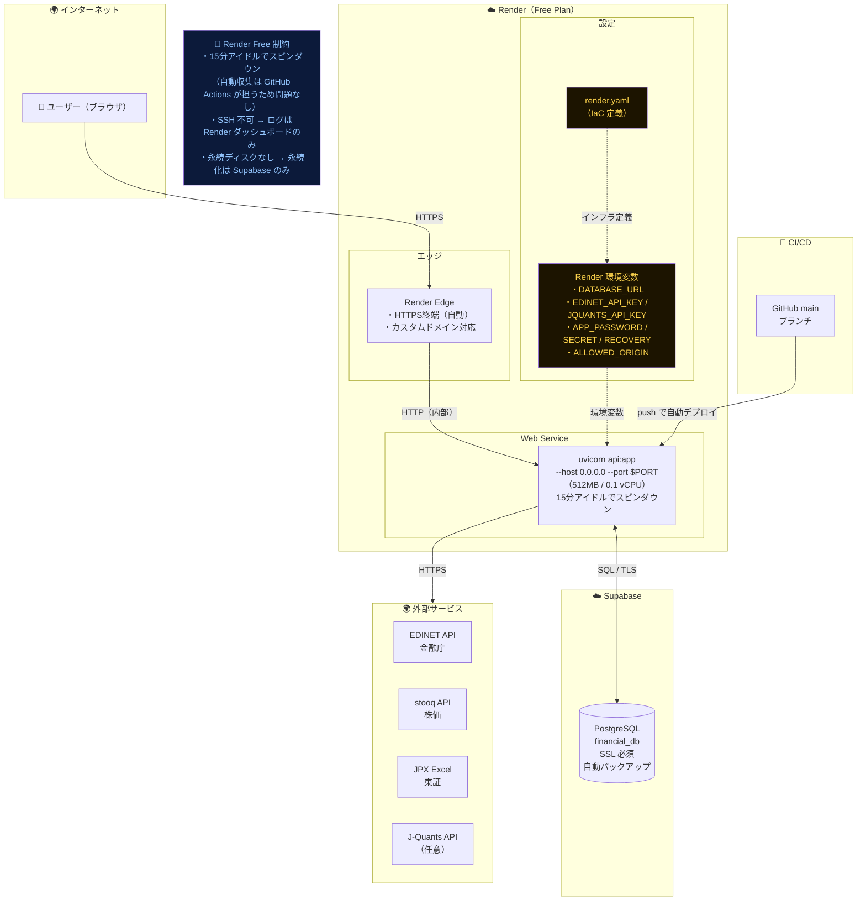

---

## 10. ファイル役割一覧

| ファイル | 種別 | 役割 | 主な依存先 |
|---|---|---|---|
| `api.py` | バックエンド | REST API窓口・認証・SSE・手動収集トリガー（自動収集は GitHub Actions が担当） | database.py, collector.py, plugins/ |
| `database.py` | バックエンド | DBテーブル定義・upsert・成長率/Zスコア計算。6テーブル（Company / FinancialRecord / StockPriceHistory / MacroData / CollectionLog / XbrlRawDocument）。`pack_elements`/`unpack_elements`/`upsert_xbrl_raw` ヘルパを含む | PostgreSQL |
| `collector.py` | バックエンド | EDINET/stooq/JPX/マクロデータからデータ収集→DB保存。`MACRO_SERIES` で為替・金利・指数・コモディティ9系列を定義 | EDINET API, stooq, JPX |
| `checker.py` | バックエンド | データ品質チェック（NULL率・外れ値・収録状況） | database.py |
| `plugins/base.py` | バックエンド | 分析プラグインの抽象基底クラス | — |
| `plugins/__init__.py` | バックエンド | プラグインを自動スキャン・レジストリ管理 | plugins/*.py |
| `plugins/gap_analysis.py` | バックエンド | 乖離分析（割安・割高ランキング） | plugins/utils.py |
| `plugins/recommend.py` | バックエンド | 複合スコアによる銘柄推薦 | plugins/utils.py |
| `plugins/total_return.py` | バックエンド | 配当込みトータルリターン分析 | plugins/utils.py |
| `plugins/sector_ols.py` | バックエンド | 業種別OLS回帰分析（次元整合・winsorize+z-score前処理） | plugins/utils.py |
| `plugins/price_predictor.py` | バックエンド | 株価リターン予測（価格×財務特徴量OLS・月次WFV） | plugins/utils.py |
| `plugins/net_cash_analysis.py` | バックエンド | ネットキャッシュ分析（清原達郎『わが投資術』式）。NC = 流動資産 + 投資有価証券×0.7 − 総負債 | database.py |
| `plugins/utils.py` | バックエンド | ols()・normalize()・winsorize()・walk_forward_cv()・walk_forward_cv_monthly() | — |
| `tests/` | テスト | pytest 回帰テスト（188件）。プラグイン7個＋utils＋`database.py`（upsert・年度別Zスコア）＋`collector.py`（XBRLパース・派生指標＋ネットワーク取得を httpx MockTransport でモック）＋`api.py`（純関数・`/health`・DB-backed 読取エンドポイント）をカバー。in-memory SQLite fixture（StaticPool）／FastAPI TestClient／httpx MockTransport で検証。共通 fixture は `tests/conftest.py`（`db`/`make_fin` 等） | pytest, sqlalchemy, fastapi, httpx |
| `requirements-dev.txt` | 設定 | 開発・テスト専用依存（`pytest`）。本番 `requirements.txt` と分離（Render メモリ節約） | — |
| `dashboard.html` | フロントエンド | トップページ・全体サマリー（`/`） | api.py |
| `collection.html` | フロントエンド | 収集管理・スクリーニング・DBブラウザ（`/collection`） | api.py |
| `analysis.html` | フロントエンド | 回帰分析・乖離分析・プラグイン（`/analysis`）。乖離分析タブに横断分布（理論vs実績の散布図・乖離率ヒストグラム）を Chart.js で表示 | api.py, Chart.js (CDN) |
| `login.html` | フロントエンド | 認証ログイン画面（`/login`） | api.py |
| `models.html` | フロントエンド | モデル解説・参考文献ページ（`/models`）。8モデルの数式・パラメータ・DOIリンクをインラインHTMLで表示。 | — |
| `db.html` | フロントエンド | DBビューア（`/db`）。4テーブルのスキーマ・プレビュー・統計サマリー・ER 風リレーション・企業ドリルダウン・CSV エクスポート。 | api.py |
| `company.html` | フロントエンド | 企業詳細（`/company`・`/company/{edinet_code}`）。個別企業の業績・財務(BS)・CF・per-share/配当・バリュエーション（理論時価総額乖離）・日次株価・業種内Zスコアレーダー・清原式ネットキャッシュ・同業比較を Chart.js の時系列グラフで可視化。企業名・証券コード検索付き。 | api.py, Chart.js (CDN) |
| `_pipeline_gh.py` | GitHub Actions | 全件収集パイプライン（full-pipeline.yml から workflow_dispatch 手動起動） | collector.py, database.py |
| `_pipeline_incremental.py` | GitHub Actions | 差分収集パイプライン（daily-incremental.yml で毎日 JST 03:00 自動実行） | collector.py, database.py |
| `check.py` | ユーティリティ | EDINET API 疎通確認ワンショット | EDINET API |
| `.env` | 設定 | APIキー・DB接続・認証情報（UTF-8 BOMなし） | — |
| `ARCHITECTURE.md` | ドキュメント | 本ファイル。コード変更時は必ず更新する | — |
| `MODELS.md` | ドキュメント | 分析モデルの数式・パラメータ・参考文献（Markdown版）。モデル変更時は `models.html` とセットで更新する。 | — |
| `FUTURE_TASKS.md` | ドキュメント | 今後実装予定の機能仕様（時系列予測モデルなど） | — |
| `VISUALIZATION_IMPROVEMENTS.md` | ドキュメント | 企業データ可視化強化の改善案（バフェット・コード型・Chart.js・企業詳細ページ） | — |
| `VISION.md` | ドキュメント | プロジェクトの目的・方針 | — |
| `CLAUDE.md` | 設定 | Claude Codeへの動作指示 | — |
