# 企業データ可視化の大幅強化 — 改善案

| 項目 | 内容 |
|---|---|
| ステータス | 🔄 **Phase 1〜3 実装済み**（F1〜F10）／Phase 4（仕上げ）は提案 |
| 作成日 | 2026-05-26 |
| ベンチマーク | [バフェット・コード](https://www.buffett-code.com/) |
| 関連 | [VISION.md](VISION.md)（完成定義#2「投資情報サイトのような操作感」）/ [ARCHITECTURE.md](ARCHITECTURE.md) / [FUTURE_TASKS.md](FUTURE_TASKS.md) |

---

## 1. 概要（なぜやるか）

本ツールは EDINET / J-Quants から収集した財務・株価データに加え、**理論時価総額・乖離率・8軸Zスコア・清原式ネットキャッシュ・成長率**といった分析指標まで算出済みで、**データは非常に充実している**。一方で**可視化は極めて弱い**：

- チャートライブラリ未使用（`templates/analysis.html` の手書き SVG ヒストグラム 1 種＋テーブルのみ）。
- 個別企業の詳細は `templates/collection.html` のモーダルで**生データを表示するのみ**。専用の企業ページ・時系列グラフが存在しない。
- 結果として VISION.md の完成定義 #2「投資情報サイトのような操作感」に未到達。

ベンチマークの**バフェット・コード**は、個別企業ページ（左メニュー：株価／業績／財務／CF／配当／セグメント／バリュエーション）に 10 年超の業績推移グラフ・複合棒＋折れ線・積み上げ棒・同業比較を備え、UI/UX に優れる。

**ゴール**: 「データは揃っているのに見せ方が弱い」というギャップを埋め、**専用の企業詳細ページ**でバフェット・コード級の可視化を実現する。さらに本ツール独自の分析資産（理論株価乖離・Zスコア・ネットキャッシュ）を前面に出し、単なる模倣に留めない。

> 本書は**改善案のまとめ**であり、実装は本書承認後の別作業とする。

---

## 2. 現状の課題

| 観点 | 現状 | 課題 |
|---|---|---|
| チャート基盤 | 外部ライブラリ未使用。手書き SVG 1 種のみ | 時系列・複合・積み上げ・レーダー等が描けない |
| 企業詳細 | `collection.html` のモーダルで生データ表示 | 1 社の財務推移を俯瞰できる画面が無い |
| 表示形式 | テーブル中心 | 数値の羅列で傾向・構成比が直感的に掴めない |
| 株価 | 日次 OHLCV を DB 保有（`StockPriceHistory`）も UI 無し | 株価チャート・理論株価との対比が見られない |
| 独自指標 | 理論株価乖離・Zスコア・ネットキャッシュを算出済みも可視化されず | 本ツール最大の差別化要素が埋もれている |

---

## 3. ベンチマーク分析（バフェット・コード）

バフェット・コードの主要機能と、本ツールの保有データでの**実現可否**（`database.py` で確認済み）：

| バフェット・コードの機能 | 実現可否 | 使用データ |
|---|---|---|
| 業績推移（売上・営業/経常/純利益・EBITDA） | ✅ 可 | `pl_revenue` / `pl_operating_profit` / `pl_ordinary_profit` / `pl_net_income` / `pl_ebitda` |
| 利益率推移（粗利/営業/純利益率） | ✅ 可 | `op_margin` / `net_margin`（粗利率は `pl_gross_profit ÷ pl_revenue`） |
| BS 構成（流動/固定の資産・負債・純資産・借入） | ✅ 可（詳細まで） | `bs_*` 17 項目（current/noncurrent、short/long_term_debt、bonds、retained_earnings 等） |
| キャッシュフロー（営業/投資/財務/FCF・設備投資） | ✅ 可 | `cf_operating_cf` / `cf_investing_cf` / `cf_financing_cf` / `cf_free_cf` / `cf_capex` |
| per-share（EPS/BPS/DPS）・配当・利回り | ✅ 可 | `pl_eps` / `bs_bps` / `dps` / `div_yield` |
| バリュエーション（PER/PBR/ROE/ROA 推移） | ✅ 可 | `per` / `pbr` / `roe` / `roa` / `de_ratio` |
| 株価チャート（日次・ローソク足可） | ✅ 可 | `StockPriceHistory`（OHLCV 日次） |
| **理論株価との乖離** | ✅ **独自** | `predicted_market_cap` / `gap_ratio`（gap_analysis / total_return） |
| **業種内ポジション（8 軸 Zスコア）** | ✅ **独自** | `z_revenue` / `z_op_margin` / `z_roe` / `z_equity_ratio` / `z_cf_ratio` / `z_eps` / `z_de_ratio` / `z_nc_ratio` |
| **清原式ネットキャッシュ** | ✅ **独自** | `net_cash` / `nc_ratio` |
| 同業他社比較 | ✅ 可 | 複数 `edinet_code` を取得し横並べ |
| セグメント別売上・利益 | ❌ 非対応 | XBRL_MAP 未収集（collector 拡張が必要 → 将来課題） |
| 四半期業績 | ❌ 非対応 | 年次データのみ（有報ベース） |
| 業績予想 | ❌ 非対応 | 予想値は未収集 |

**フレーミング**: 標準的な業績ビューはバフェット・コードに追随しつつ、**理論株価乖離・8 軸Zスコア・清原式ネットキャッシュ・AR(1) 収束**という独自の分析資産を可視化することで差別化する（これらはバフェット・コードに無い／有料の領域）。

---

## 4. 提案の全体像

専用の企業詳細ページ `/company/{edinet_code}`（`templates/company.html`）を新設し、Chart.js でバフェット・コード型のタブ構成を実装する。URL ↔ HTML の命名規則（CLAUDE.md）に準拠。

```mermaid
graph LR
  D[ダッシュボード /]
  C[収集・スクリーニング /collection]
  A[分析 /analysis]
  NEW[★企業詳細 /company/&#123;edinet_code&#125;]
  D --> NEW
  C -->|銘柄クリック| NEW
  A -->|ランキングから| NEW
  subgraph NEW タブ
    T1[業績]
    T2[財務BS]
    T3[CF]
    T4[per-share・配当]
    T5[バリュエーション]
    T6[業種内ポジション]
    T7[同業比較]
  end
```

- 既存の `dashboard.html` のカラーパレット（`#0f1117`/`#1a1d2e`/`#a78bfa` 系）と共通ヘルパー（`apiFetch` / `esc` / `showNotif`）・認証フローをそのまま再利用。
- ダッシュボードの `nav-grid` に「企業分析」カードを 1 枚追加し、導線を確保。
- 収集・分析画面の銘柄行／ランキングからワンクリックで `/company/{edinet_code}` へ遷移。

---

## 5. 機能提案（詳細・優先度付き）

各機能の「使用データ」はすべて `database.py` で実在を確認済み。

| ID | 機能 | グラフ種別 | 使用データ |
|---|---|---|---|
| **F1** | 企業詳細ページの骨格（ヘッダ＋タブ） | — | `Company`＋最新 `FinancialRecord` のサマリ |
| **F2** | 業績推移 | 複合（棒＋折れ線、第2軸に利益率） | `pl_revenue` / `pl_operating_profit` / `pl_ordinary_profit` / `pl_net_income` / `pl_ebitda` / `op_margin` / `rev_growth` |
| **F3** | 財務(BS)構成 | 積み上げ棒＋折れ線 | `bs_*`（流動/固定 資産・負債、`bs_total_equity`）＋ `equity_ratio` |
| **F4** | キャッシュフロー | 棒（符号で配色）＋折れ線 | `cf_operating_cf` / `cf_investing_cf` / `cf_financing_cf` / `cf_free_cf` / `cf_capex` |
| **F5** | per-share・配当・バリュエーション | 棒＋折れ線 | `pl_eps` / `bs_bps` / `dps` / `div_yield` / `per` / `pbr` / `roe` |
| **F6** | 株価チャート（独自バンド付き） | 折れ線（ローソク足は将来オプション） | `StockPriceHistory`（日次終値）＋理論株価バンド（`predicted_market_cap ÷ 推計株数`） |
| **F7** | 業種内ポジション（独自） | レーダー＋パーセンタイル棒 | 8 軸 Zスコア（`z_revenue`…`z_nc_ratio`、**年度別計算**） |
| **F8** | 清原式ネットキャッシュ（独自） | 棒＋指標カード | `net_cash` / `nc_ratio`（ネットキャッシュ比率 vs 時価総額） |
| **F9** | 同業比較 | グループ棒＋比較表 | 同業種 or 任意選択の複数社（売上・営業利益率・ROE・PER 等） |
| **F10** | 横断分布の強化（`analysis.html`） | 散布図・ヒストグラム | 理論時価総額 vs 実績の散布図、業種別 ROE/PER 分布（既存 SVG を Chart.js 化） |

補足：
- **F6 理論株価バンド**: 推計株数 = `bs_total_equity ÷ bs_bps`（既存 `total_return` の近似）。`predicted_market_cap`・`gap_ratio` は回帰実行後にレコードへ保存される（`/api/regression` → `/api/gap-analysis` の順序依存に注意：CLAUDE.md）。
- **F7 Zスコア**: 年度を跨いで計算しない（CLAUDE.md の既知制約）。レーダーは「最新年度の業種内偏差」を表す。
- ローソク足は Chart.js 単体では非対応（`chartjs-chart-financial` 等が必要）。初期は日次終値の折れ線で開始し、ローソク足は将来オプションとする。

---

## 6. 技術設計

### 6.1 Chart.js の導入
- **読込方法**: CDN の `<script src>`（または `static/` への同梱）。CLAUDE.md「HTML：CSS/JS インライン 1 ファイル維持（分割禁止）」は**自前コードの分割禁止**を意味し、ベンダーライブラリの読込はこれに反しない。
- **CSP**: `Content-Security-Policy` の `script-src` に CDN を追加（`unsafe-inline` は既存）。`static/` 同梱なら追加不要で、オフライン・スピンダウンにも強い（**同梱を推奨**）。
- **採用手続き**: VISION.md「サードパーティーライブラリ採用基準」＋ CLAUDE.md「パッケージ管理方針」に準拠。Chart.js（MIT ライセンス・GitHub Stars 6 万超・週次 DL 数百万・活発に保守）は基準を満たす見込みだが、**採用前に WebSearch で CVE / security vulnerability を確認しユーザー承認を得る**こと。

### 6.2 サーバー側
- **新ルート**: `api.py` に `GET /company/{edinet_code}` を追加し `templates/company.html` を返す。`edinet_code` は既存の `^E\d{6}$` バリデーションパターンを流用。
- **API は原則再利用**（新規エンドポイントは最小限）：
  - `GET /api/financials/{edinet_code}` … bs/pl/cf/val/zscore/predicted/gap を**時系列**で返す（既存）。
  - 株価日次系列 … `StockPriceHistory` を返す既存エンドポイント（`/api/stock/history` 系）を利用。
  - 同業比較（F9）用に、業種または複数コード指定で要約を返す軽量エンドポイントを **1 本だけ**追加検討。
- **認証**: 既存ミドルウェア（`/api/auth/` は常時通過）・`apiFetch` の Bearer トークン方式をそのまま利用。

### 6.3 フロントエンド
- `company.html` は単一ファイル（インライン CSS/JS）。既存テンプレの配色・コンポーネント・ヘルパーを踏襲。
- グラフは年度昇順・単位を明示（**`market_cap` のみ百万円**、`pl_revenue` 等は円：CLAUDE.md の単位例外に注意）。

---

## 7. Render 適合性

- 描画は**クライアントサイド**（ブラウザの Chart.js）。サーバーのメモリ・CPU 負荷はゼロ → Free プラン 512MB に好適。
- **Python 依存追加なし**（`requirements.txt` 変更なし）。新ルートは静的 HTML 返却のみ。
- 既存 API を再利用するため DB クエリ増は限定的。`StockPriceHistory` は日次で件数が多いため、F6 では期間（例：直近 2〜5 年）を絞って取得する。

---

## 8. データ制約・対象外（正直な明記）

| 項目 | 状態 | 理由 / 将来対応 |
|---|---|---|
| セグメント別売上・利益 | 対象外 | `XBRL_MAP`（collector.py）で未収集。収集拡張すれば将来対応可 |
| 四半期業績 | 対象外 | 有報ベースの年次データのみ |
| 業績予想 | 対象外 | 予想値を収集していない |
| 発行済株式数 | 近似 | `bs_total_equity ÷ bs_bps` の推計（FUTURE_TASKS.md「G」で正規ソース化を検討中） |

---

## 9. 実装フェーズ（優先度）

| Phase | 内容 |
|---|---|
| **1** ✅ | 企業詳細ページ骨格（F1）＋ F2/F3/F4（業績・BS・CF）— **実装済み** |
| **2** ✅ | F5/F6/F7/F8（per-share・配当・株価・理論時価総額乖離・8 軸Zスコア・ネットキャッシュ＝**独自価値**）— **実装済み** |
| **3** ✅ | F9（同業比較）・F10（横断分布・`analysis.html`）**実装済み** |
| **4** | 仕上げ（ツールチップ・レスポンシブ・CSV/画像エクスポート） |

### Phase 1 実装メモ（2026-05-26）
- 追加: `templates/company.html`（単一ファイル・インライン）、`api.py` に `GET /company` と `GET /company/{edinet_code}`、`dashboard.html` にナビカード。
- データは既存の `GET /api/financials/{edinet_code}` をそのまま利用（バックエンドのデータ変更なし）。
- Chart.js は **CDN 読込（`cdn.jsdelivr.net`、4.4.1 ピン留め）**＋ CSP `script-src` に追加。実行環境のネットワーク制約で同梱は見送り（将来、`static/` 同梱＋SRI 付与を推奨）。
- 入口: ダッシュボードのナビカード＋ページ内検索（`/api/companies`）。**スクリーニング結果表からの遷移リンクは未実装**（次段で追加予定）。
- 検証: `python -m py_compile api.py`・ルート登録確認・インラインJSの `node --check` は通過。**DB/ブラウザ非搭載環境のためグラフ描画の目視確認は未実施** → Render 上での確認が必要。

### Phase 2 実装メモ（2026-05-26）
- 企業詳細ページに 5 タブ追加（per-share・配当 / バリュエーション / 株価 / 業種内 / ネットキャッシュ）。全 8 タブ・11 グラフ構成に。
- `api.py` の `_record_to_dict` に既存カラムを追加公開（`dps`・`de_ratio`・`net_cash`・`nc_ratio`・`z_de_ratio`・`z_nc_ratio`）。**追加のみで既存レスポンスは非破壊**。
- F5: EPS/DPS（棒）＋BPS（右軸）、配当利回り・配当性向。F6: `/api/stock/history`（日次終値）。F7: 8 軸 Zスコアのレーダー（年度別・0=業種平均）。F8: ネットキャッシュ（億円）＋NC比率（倍）。
- **独自価値**: バリュエーションタブに「理論時価総額 vs 実績時価総額＋乖離率」を追加（`predicted_market_cap`/`gap_ratio`。業種別OLS回帰の実行後に表示）。
- 単位の注意（CLAUDE.md 準拠で実装）: `market_cap`/`predicted_market_cap` は**百万円**（÷100 で億円）、`net_cash` は**円**（÷1e8）、`nc_ratio` は**無次元の倍率**（%ではない）、`gap_ratio` は **%**。
- 検証: `py_compile`・タブ/パネル/canvas 整合・`node --check` 通過。**描画の目視確認は Render 上で要実施**。

### Phase 3 実装メモ（F9 同業比較・2026-05-26）
- 企業詳細ページに「同業比較」タブを追加（計 9 タブ）。**遅延ロード**（タブ初回クリック時に取得）。
- 既存の `GET /api/companies?industry=...&include_latest=true` を利用（バックエンド変更なし）。同一業種を時価総額順で上位15社＋表示中企業を抽出。
- 比較テーブル（売上・営業利益率・ROE・自己資本比率・PER・PBR・時価総額／表示中企業をハイライト・各社へリンク）＋ 営業利益率・ROE の横棒グラフ（表示中企業を色分け）。
- 検証: タブ/パネル/canvas 整合・`node --check` 通過。**描画の目視確認は Render 上で要実施**。

### Phase 3 実装メモ（F10 横断分布・2026-05-26）
- `analysis.html` の乖離分析タブに横断分布カードを追加（Chart.js を CDN 読込。CSP は既存の middleware 設定で許可済み）。
- **理論 vs 実際 時価総額の散布図**（対数軸・億円。対角線＝理論=実際の基準線。点の色: 緑=理論≥実際=割安寄り／赤=割高寄り）。データは既存 `gapResults`（`/api/gap-analysis`）を再利用。
- **乖離率ヒストグラム**（8 ビン・社数。正=緑／負=赤）。
- **不具合修正**: 乖離分析テーブルの時価総額が `/1e6`（誤）で約1万分の1に表示されていたのを `/100`（百万円→億円、`fmtCap` と同基準）に修正。
- 既存のバックテストSVGヒストグラムは安定動作のため変更せず（Chart.js 置換は将来課題）。
- 検証: `node --check`・要素整合 通過。**描画の目視確認は Render 上で要実施**。

---

## 10. 既存資産の再利用

| 資産 | 場所 | 用途 |
|---|---|---|
| `apiFetch` / `esc` / `showNotif` | 各テンプレ `<script>` | API 取得・XSS エスケープ・通知 |
| カラーパレット・カードCSS | `dashboard.html` | 配色・レイアウトの統一 |
| `/api/financials/{edinet_code}` | `api.py` | 1 社の財務時系列 |
| `StockPriceHistory` / 株価系列 API | `database.py` / `api.py` | 株価チャート |
| `edinet_code` バリデーション（`^E\d{6}$`） | `api.py` | 新ルートの入力検証 |
| 認証ミドルウェア・トークン方式 | `api.py` | 既存と同じ認証 |

---

## 11. 関連ドキュメントの更新（実装時に必須・CLAUDE.md ルール）

- `docs/ARCHITECTURE.md`：画面遷移図（セクション5）・コンポーネント図／API 一覧（セクション1・8）・ファイル役割一覧（セクション10）に `company.html` と新ルートを追加。
- `docs/VISION.md`：ロードマップへ可視化強化を反映。
- `CLAUDE.md` / `README.md`：ファイル構成表に `templates/company.html` を追加し、本書へリンク。
- 必要に応じ `templates/models.html`：理論株価バンド等、可視化に用いる算出ロジックの説明。

---

## 12. 参考

- バフェット・コード — <https://www.buffett-code.com/>（個別企業ページ・企業比較 `comps`・スクリーニング）
- Chart.js — <https://www.chartjs.org/>（MIT ライセンス）
- 内部: [VISION.md](VISION.md) / [ARCHITECTURE.md](ARCHITECTURE.md) / [FUTURE_TASKS.md](FUTURE_TASKS.md) / [MODELS.md](MODELS.md)
